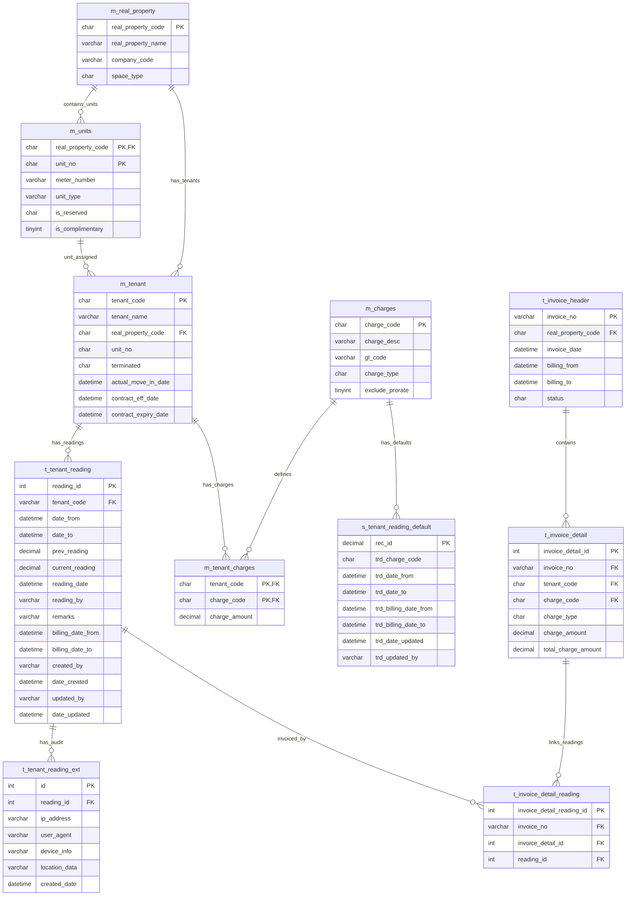

# Tenant Reading Data Mapping & ERD

## Overview
This document provides the data mapping and Entity Relationship Diagram (ERD) for the tenant reading system within the RMS (Real Estate Management System). It focuses on the tables and relationships involved in capturing, storing, and processing meter readings for utility billing.

## 🔗 Complete ERD (Tenant Reading Domain)



## NEW SCHEMA REQUIREMENTS

### 1. Update t_tenant_reading Table
```sql
-- Add new tracking columns to existing table
ALTER TABLE t_tenant_reading 
ADD reading_date datetime NULL,           -- Actual date/time of reading (server-side)
    reading_by nvarchar(32) NULL;        -- Technician who took reading
```

### 2. Create Extended Properties Table
```sql
-- New table for audit trail and metadata
CREATE TABLE t_tenant_reading_ext (
    id int IDENTITY(1,1) PRIMARY KEY,
    reading_id int NOT NULL,              -- Foreign key to t_tenant_reading
    ip_address varchar(45) NULL,         -- IP address for audit trail
    user_agent nvarchar(500) NULL,       -- User agent for audit trail
    device_info nvarchar(200) NULL,      -- Device information
    location_data nvarchar(500) NULL,    -- GPS/location if available
    created_date datetime DEFAULT GETDATE(),
    
    CONSTRAINT FK_reading_ext_reading 
    FOREIGN KEY (reading_id) REFERENCES t_tenant_reading(reading_id)
);

-- Performance indexes for audit queries
CREATE INDEX IX_reading_ext_reading_id ON t_tenant_reading_ext(reading_id);
CREATE INDEX IX_reading_ext_audit ON t_tenant_reading_ext(ip_address, created_date);
```

### 3. s_tenant_reading_default (Already Exists)
The table `s_tenant_reading_default` already exists in the database with the following structure:
- `rec_id` decimal(18,0) IDENTITY(1,1) PK
- `trd_charge_code` char(5) - Charge code (CUCF, CUCNF, etc.)
- `trd_date_from` datetime - Default reading period start
- `trd_date_to` datetime - Default reading period end  
- `trd_billing_date_from` datetime - Default billing period start
- `trd_billing_date_to` datetime - Default billing period end
- `trd_date_updated` datetime - Last update timestamp
- `trd_updated_by` varchar(50) - User who last updated

## Data Flow (QR → Save Reading)

1. **Technician scans QR** → UI extracts `propertyCode`, `unitNo` (and optionally `meterId`)
2. **Primary**: UI fetches `tenant_code` by `real_property_code = propertyCode` AND `unit_no = unitNo` AND `ISNULL(terminated,'N') = 'N'`
3. **Fallback**: If no active tenant found, system retrieves last active tenant from `vw_TenantReading` for the same property/unit
4. **Technician enters** `current_reading` (+ reading date)
5. **NEW**: System checks `s_tenant_reading_default` for CUCF/CUCNF default values
6. **NEW**: System calculates reading period and billing period dates using business logic
7. **API composes payload** and writes to `t_tenant_reading` + `t_tenant_reading_ext`

## QR Code Data Structure

- **Required**: `real_property_code|unit_no`
- **Optional**: `|meter_id` (linked via `m_units.meter_number`)
- **Example**: `GCA|101` or `GCA|101|M001`
- **Security**: QR codes do NOT contain tenant information

## BUSINESS LOGIC IMPLEMENTATION

### 1. Default Values Lookup

```sql
-- Check for default charge code values and date periods
SELECT trd_charge_code, trd_date_from, trd_date_to, 
       trd_billing_date_from, trd_billing_date_to
FROM s_tenant_reading_default 
WHERE trd_charge_code IN ('CUCF', 'CUCNF')
  AND trd_date_from IS NOT NULL
  AND trd_date_to IS NOT NULL;
```

### 2. Date Calculation Logic
**Reading Period**: Covers the month when reading was taken
- `date_from`: 1st day of reading month
- `date_to`: Last day of reading month

**Billing Period**: Covers the following month for invoice generation
- `billing_date_from`: 1st day of month AFTER reading month
- `billing_date_to`: Last day of month AFTER reading month

**Example Implementation**:
```php
// Given reading date: 08/29/2025 14:28
$readingDate = new DateTime('2025-08-29 14:28:00');

// Reading period: August 1-31, 2025
$dateFrom = new DateTime('2025-08-01 00:00:00');
$dateTo = new DateTime('2025-08-31 23:59:59');

// Billing period: September 1-30, 2025
$billingDateFrom = new DateTime('2025-09-01 00:00:00');
$billingDateTo = new DateTime('2025-09-30 23:59:59');
```

### 3. Tenant Move-In/Out Edge Cases
When readings occur during tenant transitions, default period rules are overridden:

**Move-Out Reading**:
- `date_to`: Move-out date (not end of month)
- `billing_date_to`: Move-out date + 1 day

**Move-In Reading**:
- `date_from`: Day after previous reading's `date_to`
- `prev_reading`: From unit-level (not tenant-specific)

## Primary Lookup Path (QR → Tenant)
```sql
-- Primary: Active tenant lookup using property + unit
SELECT t.tenant_code, t.tenant_name, t.actual_move_in_date, t.contract_expiry_date
FROM m_tenant t
WHERE t.real_property_code = @propertyCode
  AND t.unit_no = @unitNo
  AND ISNULL(t.terminated,'N') = 'N'
ORDER BY t.actual_move_in_date DESC;

-- Fallback: If no active tenant found, get last active tenant from vw_TenantReading
-- This handles scenarios where readings are taken between tenant transitions
IF @@ROWCOUNT = 0
BEGIN
    SELECT TOP 1 
        tr.tenant_code,
        tr.tenant_name,
        tr.actual_move_in_date,
        tr.contract_expiry_date
    FROM vw_TenantReading tr
    WHERE tr.real_property_code = @propertyCode
      AND tr.unit_no = @unitNo
    ORDER BY tr.date_created DESC
END
```

## Meter ID Lookup (Optional)
```sql
-- Get meter information if provided in QR
SELECT u.meter_number, u.unit_type
FROM m_units u
WHERE u.real_property_code = @propertyCode
  AND u.unit_no = @unitNo;
```

## Previous Reading Retrieval
```sql
-- Get last reading for the unit (property + unit combination)
SELECT TOP 1 r.current_reading, r.reading_date, r.date_to
FROM t_tenant_reading r
INNER JOIN m_tenant t ON r.tenant_code = t.tenant_code
WHERE t.real_property_code = @propertyCode
  AND t.unit_no = @unitNo
ORDER BY r.reading_date DESC;
```

## Database Indexes
```sql
-- Performance optimization for tenant lookups
CREATE INDEX IX_m_tenant_property_unit_active 
ON m_tenant (real_property_code, unit_no, terminated) 
WHERE ISNULL(terminated,'N') = 'N';

-- Performance optimization for unit lookups
CREATE INDEX IX_m_units_property_unit 
ON m_units (real_property_code, unit_no);

-- Performance optimization for reading queries
CREATE INDEX IX_t_tenant_reading_tenant_date 
ON t_tenant_reading (tenant_code, reading_date DESC);

CREATE INDEX IX_t_tenant_reading_property_unit 
ON t_tenant_reading (tenant_code, date_from, date_to);
```

## Meter Reading Report System

### Features
- **Filtering**: Date range, property, technician, status
- **Columns**: Property, Unit, Tenant, Reading Date, Periods, Readings, Usage, Technician, Validation
- **Export**: PDF, Excel, CSV formats
- **Audit**: IP address, user agent, device info, location data

### Report Query
```sql
-- Comprehensive reading report for audit and validation
SELECT 
    p.real_property_name,
    t.unit_no,
    t.tenant_name,
    r.reading_date,
    r.date_from as reading_period_start,
    r.date_to as reading_period_end,
    r.billing_date_from,
    r.billing_date_to,
    r.prev_reading,
    r.current_reading,
    (r.current_reading - r.prev_reading) as usage,
    r.reading_by,
    r.remarks,
    r.date_created,
    ext.ip_address,
    ext.user_agent
FROM t_tenant_reading r
INNER JOIN m_tenant t ON r.tenant_code = t.tenant_code
INNER JOIN m_real_property p ON t.real_property_code = p.real_property_code
LEFT JOIN t_tenant_reading_ext ext ON r.reading_id = ext.reading_id
WHERE r.reading_date BETWEEN @startDate AND @endDate
  AND (@propertyFilter IS NULL OR t.real_property_code = @propertyFilter)
  AND (@technicianFilter IS NULL OR r.reading_by = @technicianFilter)
ORDER BY r.reading_date DESC, p.real_property_name, t.unit_no
```

### API Endpoint
- **GET** `/api/meter-reading-report.php`
- **Parameters**: `startDate`, `endDate`, `propertyFilter`, `technicianFilter`, `statusFilter`
- **Response**: JSON with paginated results and export options
