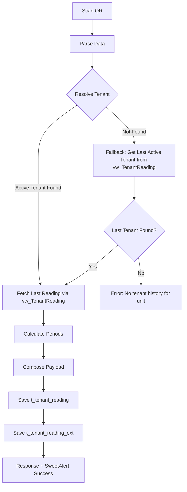
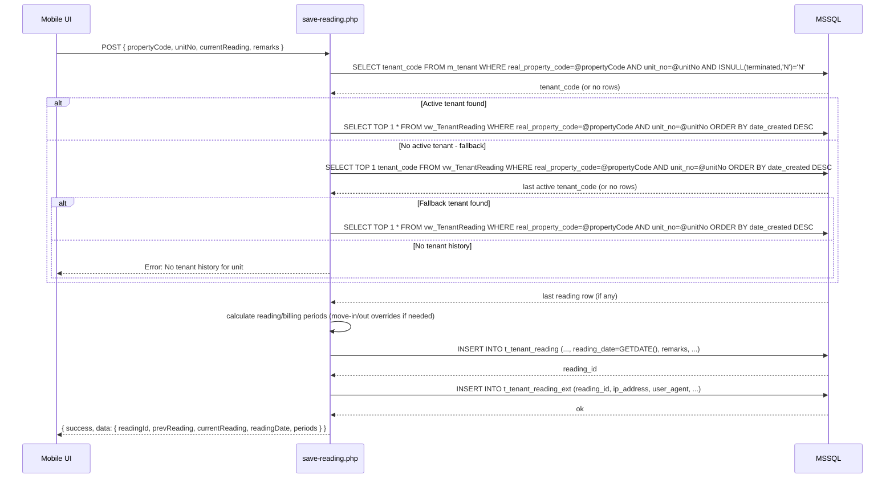

# Tenant Reading Workflow - QR Meter Reading

## Overview
End-to-end flow from QR scan to database writes, including tenant lookup, default value resolution, date calculations, and audit trail persistence.

---

## 1) High-Level Process

Notes:
- QR content: `propertyCode|unitNo` (+ optional `meter_id`)
- **Primary tenant resolution**: `m_tenant` by `real_property_code = propertyCode AND unit_no = unitNo AND ISNULL(terminated,'N') = 'N'`
- **Fallback tenant resolution**: If no active tenant, get last active tenant from `vw_TenantReading` for same property/unit
- Last reading: `vw_TenantReading` by unit (not tenant)

---

## 2) Detailed Backend Workflow

---

## 3) Move-In/Out Rules (Overrides)
- Move-out reading (between tenants):
  - Save under last active tenant; `date_to = move_out_date`, `billing_date_to = move_out_date + 1 day`
- Next tenant in same month:
  - `date_from = previous date_to + 1 day`, month-end rules for `date_to`; billing = next month
- `prev_reading`: unit-level (via `vw_TenantReading`), not tenant-limited

---

## 4) Data Mapping Summary
- Request: `propertyCode`, `unitNo`, `currentReading`, `remarks`
- Derived: `readingDate` (server time), `prevReading` (view), `date_from/date_to`, `billing_date_from/billing_date_to`
- Writes:
  - `t_tenant_reading`: tenant_code, periods, readings, reading_date, reading_by, remarks
  - `t_tenant_reading_ext`: ip_address, user_agent, device_info, location_data

---

## 5) UI Behavior
- Reading Date field: read-only in UI; server sets actual timestamp
- After successful QR scan: autofocus Current Meter Reading input
- SweetAlert on success/error with concise summary

---

## 6) Reporting Linkage
- Report endpoint queries `t_tenant_reading` (+ join `t_tenant_reading_ext`) by date range/property/technician
- Usage = `current_reading - prev_reading`
- Exports: PDF, Excel, CSV
