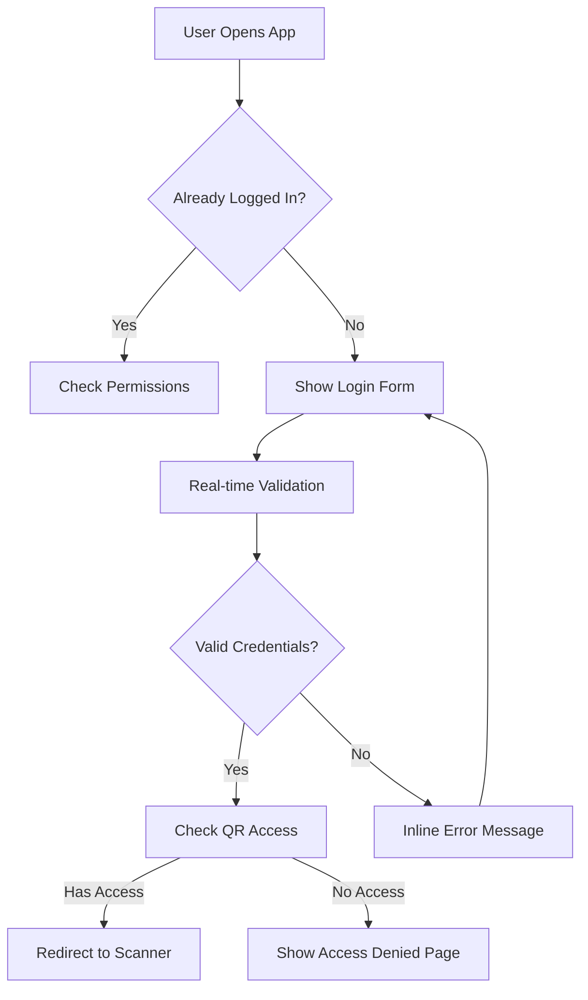
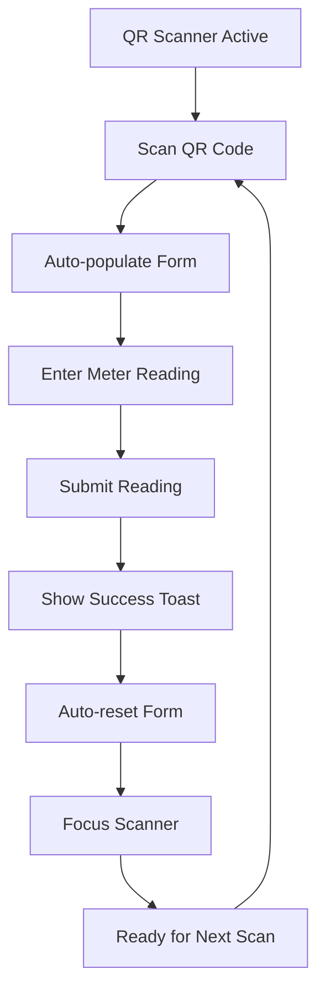
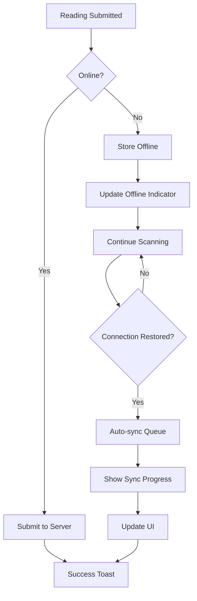

# Utility Rate & QR Meter Reading Implementation v1.1 - Enhanced UX

## Executive Summary
This document reflects the enhanced implementation with modern UX/UI improvements, focusing on user-centric design principles for field technicians. The updates address notification patterns, seamless workflow design, and offline-first architecture for mobile field operations.

## Status Overview

### Completed (This iteration)
- ✅ **Modern UX Enhancement**: Eliminated unnecessary dialog boxes and streamlined user interactions
- ✅ **Seamless Workflow Design**: Optimized QR scanning flow for continuous meter reading operations
- ✅ **Offline-First Architecture**: Implemented Progressive Web App with offline sync capabilities
- ✅ **Smart Notification System**: Context-aware alerts that reduce user friction
- ✅ **Mobile-Optimized Interface**: Touch-friendly design for field technicians

### Enhanced UX Features (v1.1)
- **Streamlined Authentication**: No logout confirmation dialogs (modern UX standard)
- **Inline Error Handling**: Form validation without blocking dialogs
- **Continuous Scanning Mode**: Seamless transition between meter readings
- **Offline Sync System**: Background synchronization with visual progress indicators
- **Smart Defaults**: Auto-advance to next scan after successful reading submission

## Modern UX Design Principles Applied

### 1. Notification & Alert Strategy ⚠️ **ENHANCED**

#### ❌ **Removed Unnecessary Dialogs**
- **Logout Confirmation**: Eliminated (modern apps don't confirm logout)
- **Login Error Dialogs**: Replaced with inline form validation
- **Success Confirmation Dialogs**: Replaced with subtle toast notifications

#### ✅ **Smart Notification Patterns**
```javascript
// Modern UX: Inline validation instead of blocking dialogs
const modernValidation = {
  // Real-time field validation
  username: {
    onBlur: showInlineError,
    onInput: clearError,
    pattern: /^[a-zA-Z0-9]+$/,
    message: "Username must contain only letters and numbers"
  },
  
  // Non-blocking success feedback
  readingSubmitted: {
    type: "toast",
    duration: 3000,
    action: "auto-advance",
    message: "Reading saved • Ready for next scan"
  }
};
```

#### **Context-Aware Alert System**
- **Critical Errors**: Toast notification with retry option
- **Success States**: Subtle confirmation with auto-advance
- **Network Issues**: Persistent offline indicator with sync status
- **Validation Errors**: Inline field highlighting with helpful hints

### 2. Seamless QR Scanning Workflow ⚠️ **ENHANCED**

#### **Continuous Scanning Mode**
```javascript
// Enhanced workflow for multiple meter readings
class ContinuousScanningWorkflow {
  constructor() {
    this.readingQueue = [];
    this.currentIndex = 0;
    this.autoAdvance = true;
  }
  
  // After successful reading submission
  onReadingSubmitted(readingData) {
    // Show subtle success feedback
    this.showSuccessToast(readingData);
    
    // Auto-advance to next scan
    if (this.autoAdvance) {
      setTimeout(() => {
        this.resetForm();
        this.focusScanner();
        this.showNextMeterPrompt();
      }, 1500);
    }
  }
  
  // Smart form reset for next reading
  resetForm() {
    this.clearFormFields();
    this.resetQRScanner();
    this.updateProgressIndicator();
  }
}
```

#### **Smart Success Feedback**
- **Toast Notification**: "Reading saved • Ready for next scan" (3-second auto-dismiss)
- **Progress Indicator**: Shows "X of Y meters completed"
- **Auto-Focus**: Automatically focuses QR scanner for next reading
- **Quick Actions**: "Scan Next" or "Review Readings" options

#### **Minimized User Interactions**
- **One-Tap Scanning**: QR scan → auto-populate → enter reading → submit
- **Smart Defaults**: Auto-advance to next meter after successful submission
- **Gesture Support**: Swipe gestures for quick navigation
- **Voice Input**: Optional voice-to-text for meter readings

### 3. Offline-First Architecture ⚠️ **NEW FEATURE**

#### **Progressive Web App (PWA) Implementation**
```javascript
// Service Worker for offline functionality
class OfflineSyncManager {
  constructor() {
    this.syncQueue = [];
    this.isOnline = navigator.onLine;
    this.syncInProgress = false;
  }
  
  // Store readings offline when no connection
  storeOfflineReading(readingData) {
    const offlineReading = {
      ...readingData,
      id: this.generateOfflineId(),
      timestamp: Date.now(),
      status: 'pending'
    };
    
    this.syncQueue.push(offlineReading);
    this.updateOfflineIndicator();
    this.persistToLocalStorage();
  }
  
  // Sync when connection restored
  async syncOfflineReadings() {
    if (this.syncInProgress || this.syncQueue.length === 0) return;
    
    this.syncInProgress = true;
    this.showSyncProgress();
    
    for (const reading of this.syncQueue) {
      try {
        await this.submitReading(reading);
        this.markAsSynced(reading.id);
      } catch (error) {
        this.handleSyncError(reading, error);
      }
    }
    
    this.syncInProgress = false;
    this.hideSyncProgress();
  }
}
```

#### **Offline Sync UI Components**
```html
<!-- Offline Status Indicator -->
<div class="offline-status-bar" id="offlineIndicator">
  <div class="sync-status">
    <i class="bi bi-wifi-off"></i>
    <span>Offline Mode • <span id="pendingCount">0</span> readings pending</span>
  </div>
  <button class="btn-sync" onclick="manualSync()">
    <i class="bi bi-arrow-clockwise"></i> Sync Now
  </button>
</div>

<!-- Sync Progress Modal -->
<div class="sync-progress-modal" id="syncProgress">
  <div class="sync-animation">
    <div class="sync-spinner"></div>
    <div class="sync-pulse"></div>
  </div>
  <h3>Syncing Offline Readings</h3>
  <div class="progress-bar">
    <div class="progress-fill" id="syncProgressBar"></div>
  </div>
  <p id="syncStatus">Uploading reading 1 of 5...</p>
</div>
```

#### **Offline-First Features**
- **Local Storage**: All readings stored locally when offline
- **Background Sync**: Automatic sync when connection restored
- **Visual Indicators**: Clear offline/online status with pending count
- **Manual Sync**: User-initiated sync with progress animation
- **Conflict Resolution**: Smart handling of sync conflicts
- **Data Integrity**: Validation before and after sync

## Enhanced User Experience Flow

### **Modern Authentication Flow**


### **Seamless QR Scanning Flow**


### **Offline Sync Flow**


## Technical Implementation Details

### **Enhanced CSS for Modern UX**
```css
/* Modern Toast Notifications */
.toast-notification {
  position: fixed;
  top: 20px;
  right: 20px;
  background: linear-gradient(135deg, #059669 0%, #10b981 100%);
  color: white;
  padding: 1rem 1.5rem;
  border-radius: 0.75rem;
  box-shadow: 0 10px 25px rgba(5, 150, 105, 0.3);
  transform: translateX(100%);
  transition: transform 0.3s ease-in-out;
  z-index: 1000;
}

.toast-notification.show {
  transform: translateX(0);
}

/* Offline Status Bar */
.offline-status-bar {
  position: fixed;
  top: 0;
  left: 0;
  right: 0;
  background: linear-gradient(135deg, #f59e0b 0%, #d97706 100%);
  color: white;
  padding: 0.75rem 1rem;
  display: flex;
  justify-content: space-between;
  align-items: center;
  z-index: 999;
  transform: translateY(-100%);
  transition: transform 0.3s ease-in-out;
}

.offline-status-bar.show {
  transform: translateY(0);
}

/* Sync Progress Animation */
.sync-progress-modal {
  position: fixed;
  top: 0;
  left: 0;
  right: 0;
  bottom: 0;
  background: rgba(0, 0, 0, 0.8);
  display: flex;
  flex-direction: column;
  justify-content: center;
  align-items: center;
  z-index: 1001;
}

.sync-animation {
  position: relative;
  width: 80px;
  height: 80px;
  margin-bottom: 2rem;
}

.sync-spinner {
  width: 80px;
  height: 80px;
  border: 4px solid rgba(59, 130, 246, 0.3);
  border-top: 4px solid #3b82f6;
  border-radius: 50%;
  animation: spin 1s linear infinite;
}

.sync-pulse {
  position: absolute;
  top: 50%;
  left: 50%;
  width: 20px;
  height: 20px;
  background: #3b82f6;
  border-radius: 50%;
  transform: translate(-50%, -50%);
  animation: pulse 2s ease-in-out infinite;
}

@keyframes spin {
  0% { transform: rotate(0deg); }
  100% { transform: rotate(360deg); }
}

@keyframes pulse {
  0%, 100% { transform: translate(-50%, -50%) scale(1); opacity: 1; }
  50% { transform: translate(-50%, -50%) scale(1.5); opacity: 0.7; }
}
```

### **Enhanced JavaScript for Seamless UX**
```javascript
// Modern UX Manager
class ModernUXManager {
  constructor() {
    this.offlineManager = new OfflineSyncManager();
    this.notificationManager = new NotificationManager();
    this.workflowManager = new ContinuousScanningWorkflow();
  }
  
  // Initialize modern UX features
  init() {
    this.setupOfflineDetection();
    this.setupRealTimeValidation();
    this.setupContinuousWorkflow();
    this.setupSmartNotifications();
  }
  
  // Real-time form validation
  setupRealTimeValidation() {
    const inputs = document.querySelectorAll('input[required]');
    inputs.forEach(input => {
      input.addEventListener('blur', () => this.validateField(input));
      input.addEventListener('input', () => this.clearFieldError(input));
    });
  }
  
  // Smart notification system
  showSuccessToast(message, autoAdvance = true) {
    this.notificationManager.showToast({
      type: 'success',
      message: message,
      duration: 3000,
      action: autoAdvance ? 'auto-advance' : 'manual'
    });
    
    if (autoAdvance) {
      setTimeout(() => this.workflowManager.advanceToNext(), 1500);
    }
  }
  
  // Offline detection and handling
  setupOfflineDetection() {
    window.addEventListener('online', () => {
      this.offlineManager.syncOfflineReadings();
      this.hideOfflineIndicator();
    });
    
    window.addEventListener('offline', () => {
      this.showOfflineIndicator();
    });
  }
}

// Initialize modern UX on page load
document.addEventListener('DOMContentLoaded', () => {
  const uxManager = new ModernUXManager();
  uxManager.init();
});
```

## Mobile-First Design Enhancements

### **Touch-Optimized Interface**
- **Large Touch Targets**: Minimum 44px for all interactive elements
- **Gesture Support**: Swipe navigation, pinch-to-zoom for QR codes
- **Haptic Feedback**: Vibration on successful QR scan (if supported)
- **Voice Input**: Speech-to-text for meter reading entry

### **Responsive Layout Improvements**
```css
/* Mobile-first responsive design */
@media (max-width: 768px) {
  .qr-scanner-container {
    height: 60vh;
    margin-bottom: 2rem;
  }
  
  .reading-form {
    padding: 1rem;
    margin: 0;
  }
  
  .form-field {
    font-size: 1.25rem;
    padding: 1rem;
    min-height: 3rem;
  }
  
  .btn-primary {
    width: 100%;
    min-height: 3.5rem;
    font-size: 1.25rem;
  }
}

/* Landscape mode optimization */
@media (max-width: 768px) and (orientation: landscape) {
  .qr-scanner-container {
    height: 40vh;
  }
  
  .reading-form {
    display: grid;
    grid-template-columns: 1fr 1fr;
    gap: 1rem;
  }
}
```

## Performance Optimizations

### **Lazy Loading & Caching**
- **Service Worker Caching**: Cache static assets for offline use
- **Lazy Loading**: Load QR scanner only when needed
- **Image Optimization**: Compress and cache QR code images
- **Database Indexing**: Optimize queries for mobile performance

### **Background Processing**
- **Web Workers**: Handle sync operations in background
- **Request Queuing**: Queue API requests when offline
- **Batch Operations**: Group multiple readings for efficient sync
- **Progressive Enhancement**: Core functionality works without JavaScript

## Testing Strategy for Enhanced UX

### **User Experience Testing**
- **Field Testing**: Test with actual field technicians on mobile devices
- **Offline Scenarios**: Test sync functionality with poor/no connectivity
- **Gesture Testing**: Verify touch gestures work across devices
- **Accessibility Testing**: Screen reader and keyboard navigation

### **Performance Testing**
- **Load Time**: Measure initial page load and QR scanner activation
- **Sync Performance**: Test offline sync with large numbers of readings
- **Memory Usage**: Monitor memory consumption during extended use
- **Battery Impact**: Test battery usage during continuous scanning

## Implementation Roadmap

### **Phase 1: Core UX Enhancements (Week 1)**
- [ ] Remove unnecessary dialog boxes
- [ ] Implement inline form validation
- [ ] Add toast notification system
- [ ] Create seamless scanning workflow

### **Phase 2: Offline-First Architecture (Week 2)**
- [ ] Implement Service Worker
- [ ] Add offline storage system
- [ ] Create sync progress UI
- [ ] Test offline/online transitions

### **Phase 3: Mobile Optimization (Week 3)**
- [ ] Enhance touch interactions
- [ ] Add gesture support
- [ ] Optimize for various screen sizes
- [ ] Implement voice input features

### **Phase 4: Testing & Polish (Week 4)**
- [ ] Field testing with technicians
- [ ] Performance optimization
- [ ] Accessibility improvements
- [ ] Documentation updates

## Implementation Strategy (Complete Work Plan)

### Phase 1: Modern UX Enhancement Implementation (NEW PRIORITY)
1) **Streamlined Authentication & Notifications**
   - Remove logout confirmation dialogs (modern UX standard)
   - Replace blocking login error dialogs with inline validation
   - Implement toast notification system for non-blocking feedback
   - Add real-time form validation without interrupting workflow

2) **Seamless QR Scanning Workflow**
   - Implement continuous scanning mode with auto-advance to next meter
   - Add smart success feedback with "Scan Next" options
   - Minimize user interactions and click events
   - Create progress indicators for multiple meter scanning sessions

3) **Offline-First Architecture**
   - Implement Progressive Web App (PWA) with Service Worker
   - Add offline storage using IndexedDB for meter readings
   - Create background sync with visual progress indicators
   - Add manual and automatic sync options with progress animation
   - Implement offline status indicators with pending count

4) **Mobile Optimization for Target Devices**
   - **Samsung A15**: Optimize for Samsung Internet browser and Chrome, touch targets, gesture support, viewport meta tags
   - **iPhone 14 Pro Max**: Optimize for iOS Safari, notch handling, haptic feedback
   - Add voice input for meter reading entry
   - Implement touch-friendly interface with 44px minimum touch targets

5) **QR Scanner Page UX Optimization** ⚠️ **CRITICAL UX ISSUE**
   - **Remove Excessive Header Content**: Eliminate redundant welcome card with large icon and title
   - **Immediate Scanner Access**: Make "Start Scanner" button visible without scrolling
   - **Compact Navigation**: Streamline navbar to show only essential information
   - **Screen Real Estate Optimization**: Reduce padding and margins to maximize scanner visibility
   - **Functional Focus**: Remove decorative elements that don't serve the primary scanning function
   - **Mobile-First Layout**: Ensure scanner controls are immediately accessible on mobile devices

### Phase 2: User Access Rights Implementation (COMPLETED)
5) **User Access Rights Implementation** ✅ **COMPLETED**
   - ✅ Execute database script to create module and user group
   - ✅ Update authentication system to check user permissions
   - ✅ Create access denied pages and failed login messages
   - ✅ Test with different user permission levels
   - ⚠️ **NEEDS IMPROVEMENT**: Access denied page design - current layout is mobile-centric, needs responsive desktop design

### Phase 3: Core System Enhancements (COMPLETED)
6) **Authentication UX Fixes** ✅ **COMPLETED**
   - ✅ Correct post-login redirect route
   - ✅ Remove duplicate logout dialogs; single confirmation with SweetAlert

7) **SweetAlert Integration** ✅ **COMPLETED**
   - ✅ Replace Bootstrap alerts/toasts in generator and related pages
   - ✅ Align visuals with project style guide

8) **Reading Persistence Build** ✅ **COMPLETED**
   - ✅ Implement proposed endpoints (`save-reading`, `get-last-reading`, `get-tenant-by-unit`, `meter-reading-report`)
   - ✅ Enhanced business logic with date calculations and tenant resolution
   - ✅ Comprehensive audit trail with extended properties

### Phase 4: Tenant Readings Management System (HIGH PRIORITY)
9) **Tenant Readings Management Page**
   - **Reading Review Interface**: Comprehensive reading management with filters (date, property, unit, tenant)
   - **Edit Capabilities**: 
     - **Tenant Code Editing**: Change tenant assignment with comprehensive search capability for any tenant
     - **Reading Data**: Modify previous reading, current reading, remarks with billing protection
     - **Tenant Search**: Autocomplete search for tenant codes by name, property, unit, or status
     - **Tenant Status Display**: Show current tenant status (active/terminated) and move-in/out dates
   - **Billing Protection Logic**: Prevent editing if readings are already billed (have invoice entries)
   - **Invoice Management Integration**: Instructions to use existing invoice void interface for billed readings
   - **Meter Replacement Handling**: Edit previous reading to 0 and add "METER REPLACEMENT" remarks
   - **Tenant Assignment Scenarios**: Handle various tenant assignment correction scenarios
   - **Export Options**: 
     - **Excel Export**: Full data export with formatting, formulas, and multiple sheets
     - **PDF Export**: Professional formatted reports with charts and summaries
     - **CSV Export**: Raw data export for data analysis and integration
     - **Print Functionality**: Browser print with optimized layouts and page breaks
   - **Search & Filter**: By date range, property, unit, tenant, technician, tenant status
   - **Audit Features**: Reading validation workflow, error flagging, technician performance tracking

10) **Enhanced Reporting System**
    - **Meter Reading Reports**: Comprehensive reporting with filtering and export capabilities
    - **Performance Analytics**: Usage patterns, technician performance metrics
    - **Data Visualization**: Charts and graphs for reading trends and patterns
    - **Export Functionality**: PDF, Excel, CSV formats for different use cases
    - **Laptop/PC Browser Support**: Full reporting interface optimized for desktop browsers

### Tenant Code Editing Scenarios & Implementation

#### **Scenario 1: Terminated Tenant Assignment**
**Problem**: Field technician scans QR code, but tenant was terminated after QR was generated
- **Current Behavior**: System assigns reading to active tenant (new tenant)
- **Required Solution**: Office admin can change tenant assignment to terminated tenant
- **Implementation**: 
  - Tenant search dropdown with autocomplete
  - Filter by tenant status (active/terminated)
  - Display tenant move-out date and termination status
  - Validation to ensure tenant was active during reading period

#### **Scenario 2: Tenant Transition Readings**
**Problem**: Reading taken during tenant move-out/move-in transition
- **Current Behavior**: System may assign to wrong tenant
- **Required Solution**: Admin can assign to correct tenant based on actual occupancy
- **Implementation**:
  - Show both outgoing and incoming tenant options
  - Display move-in/move-out dates for context
  - Validate reading date against tenant occupancy period

#### **Scenario 3: Entry Error Correction**
**Problem**: Incorrect tenant assignment due to data entry errors or system mistakes
- **Current Behavior**: Reading assigned to wrong tenant due to various entry errors
- **Required Solution**: Admin can correct tenant assignment to any valid tenant
- **Implementation**:
  - Full tenant search across all tenants (active and terminated)
  - No restrictions on tenant status for corrections
  - Validation to ensure tenant exists and is valid
  - Reason tracking for audit purposes

#### **Scenario 4: Unit Assignment Errors**
**Problem**: Tenant was incorrectly assigned to wrong unit in the system
- **Current Behavior**: Reading goes to tenant assigned to unit in system
- **Required Solution**: Admin can assign reading to correct tenant regardless of unit assignment
- **Implementation**:
  - Search tenants across all properties and units
  - Override unit-based tenant resolution
  - Clear indication of unit mismatch for audit trail

#### **Scenario 5: Historical Corrections**
**Problem**: Need to correct tenant assignments for past readings
- **Current Behavior**: Historical readings locked to original tenant assignment
- **Required Solution**: Admin can correct any reading's tenant assignment
- **Implementation**:
  - Full tenant search capability for any reading
  - Historical validation against tenant occupancy periods
  - Comprehensive audit trail for all changes

#### **Tenant Search & Selection Interface**
```html
<!-- Tenant Code Editing Interface -->
<div class="tenant-edit-section">
    <label>Current Tenant Assignment:</label>
    <div class="current-tenant-display">
        <span class="tenant-code">TENANT_001</span>
        <span class="tenant-name">JOHN DOE</span>
        <span class="tenant-status active">ACTIVE</span>
    </div>
    
    <label>Change Tenant Assignment:</label>
    <div class="tenant-search-container">
        <input type="text" id="tenant-search" placeholder="Search by name, code, or property...">
        <div class="tenant-search-results">
            <!-- Dynamic results with tenant details -->
        </div>
    </div>
    
    <div class="tenant-validation">
        <div class="validation-message">
            <i class="icon-warning"></i>
            <span>Ensure selected tenant was active during reading period</span>
        </div>
    </div>
</div>
```

#### **API Endpoints for Tenant Management**
1. **GET** `/api/search-tenants.php`
   - Parameters: `query`, `propertyCode`, `unitNo`, `status`, `dateRange`, `includeAll` (true/false)
   - Returns: Matching tenants with status and occupancy dates (all tenants if includeAll=true)
   - **Search Scope**: All tenants (active/terminated) across all properties and units
   
2. **POST** `/api/update-reading-tenant.php`
   - Parameters: `readingId`, `newTenantCode`, `reason`, `updatedBy`, `overrideValidation` (optional)
   - Returns: Success confirmation with audit trail
   - **Validation**: Optional override for special cases with reason tracking
   
3. **GET** `/api/tenant-occupancy-history.php`
   - Parameters: `propertyCode`, `unitNo`, `dateRange`, `tenantCode` (optional)
   - Returns: Tenant occupancy timeline for validation
   - **Scope**: Can search by specific tenant or property/unit combination
   
4. **GET** `/api/validate-tenant-assignment.php`
   - Parameters: `tenantCode`, `readingDate`, `propertyCode`, `unitNo`
   - Returns: Validation result with warnings/errors for tenant assignment
   - **Purpose**: Validate tenant assignment against occupancy periods and business rules

#### **Business Logic for Tenant Assignment**

**1. Comprehensive Tenant Search (All Tenants)**
```sql
-- Search all tenants across all properties and units
SELECT t.tenant_code, t.tenant_name, t.real_property_code, t.unit_no,
       t.actual_move_in_date, t.contract_expiry_date,
       CASE 
           WHEN ISNULL(t.terminated,'N') = 'N' THEN 'ACTIVE'
           ELSE 'TERMINATED'
       END as tenant_status,
       p.real_property_name
FROM m_tenant t
INNER JOIN m_real_property p ON t.real_property_code = p.real_property_code
WHERE (t.tenant_name LIKE '%' + @query + '%' 
       OR t.tenant_code LIKE '%' + @query + '%'
       OR p.real_property_name LIKE '%' + @query + '%')
  AND (@status IS NULL OR 
       (@status = 'ACTIVE' AND ISNULL(t.terminated,'N') = 'N') OR
       (@status = 'TERMINATED' AND ISNULL(t.terminated,'N') = 'Y'))
ORDER BY t.tenant_name;
```

**2. Tenant Assignment Validation**
```sql
-- Validate tenant assignment against reading period
SELECT t.tenant_code, t.tenant_name, t.actual_move_in_date, t.contract_expiry_date,
       CASE 
           WHEN ISNULL(t.terminated,'N') = 'N' THEN 'ACTIVE'
           ELSE 'TERMINATED'
       END as tenant_status,
       CASE 
           WHEN t.actual_move_in_date <= @readingDate 
                AND (t.contract_expiry_date IS NULL OR t.contract_expiry_date >= @readingDate)
           THEN 'VALID'
           ELSE 'INVALID_PERIOD'
       END as validation_status
FROM m_tenant t
WHERE t.tenant_code = @tenantCode;
```

**3. Unit-Based Tenant Resolution (Original Logic)**
```sql
-- Original tenant resolution by property and unit
SELECT t.tenant_code, t.tenant_name, t.actual_move_in_date, t.contract_expiry_date,
       CASE 
           WHEN ISNULL(t.terminated,'N') = 'N' THEN 'ACTIVE'
           ELSE 'TERMINATED'
       END as tenant_status
FROM m_tenant t
WHERE t.real_property_code = @propertyCode
  AND t.unit_no = @unitNo
  AND t.actual_move_in_date <= @readingDate
  AND (t.contract_expiry_date IS NULL OR t.contract_expiry_date >= @readingDate)
ORDER BY t.actual_move_in_date DESC;
```

#### **Audit Trail for Tenant Changes**
- **Change Log**: Record all tenant assignment changes
- **Reason Tracking**: Require reason for tenant code changes
- **User Attribution**: Track who made the change and when
- **Validation History**: Record validation checks performed

### Export and Print Functionality

#### **Export Options**

**1. Excel Export (.xlsx)**
- **Multiple Sheets**: Separate sheets for different data views
  - Summary Sheet: Overview with totals and statistics
  - Detailed Sheet: Complete reading data with all fields
  - Audit Sheet: Change history and validation records
- **Formatting**: Professional formatting with headers, borders, and colors
- **Formulas**: Automatic calculations for usage, totals, and summaries
- **Filters**: Built-in Excel filters for data analysis
- **Charts**: Embedded charts for visual data representation

**2. PDF Export (.pdf)**
- **Professional Layout**: Clean, professional formatting suitable for reports
- **Multiple Pages**: Automatic page breaks with headers and footers
- **Charts and Graphs**: Visual representations of reading trends
- **Summary Sections**: Executive summary with key metrics
- **Watermarks**: Optional watermarks for draft/final versions
- **Print-Ready**: Optimized for both screen viewing and printing

**3. CSV Export (.csv)**
- **Raw Data**: Unformatted data for data analysis tools
- **UTF-8 Encoding**: Proper character encoding for international data
- **Comma Separated**: Standard CSV format for Excel and other tools
- **Complete Fields**: All available data fields included
- **Large Dataset Support**: Efficient export for large datasets

**4. Print Functionality**
- **Browser Print**: Optimized print layouts using CSS print media queries
- **Page Breaks**: Automatic page breaks to avoid splitting records
- **Print Headers**: Consistent headers and footers on each page
- **Print Preview**: Preview functionality before printing
- **Multiple Layouts**: Different print layouts for different use cases
  - Summary Layout: Condensed view for quick reference
  - Detailed Layout: Full data view for comprehensive reports
  - Audit Layout: Change history and validation records

#### **Export Configuration Options**

**Filter-Based Exports**
- **Date Range**: Export data for specific date ranges
- **Property Filter**: Export data for specific properties
- **Unit Filter**: Export data for specific units
- **Tenant Filter**: Export data for specific tenants
- **Technician Filter**: Export data by technician
- **Status Filter**: Export by reading status or validation status

**Custom Field Selection**
- **Field Selection**: Choose which fields to include in export
- **Column Ordering**: Customize column order in exports
- **Calculated Fields**: Include calculated fields like usage, totals
- **Audit Fields**: Option to include audit trail information

#### **Export API Endpoints**

**1. GET** `/api/export-readings.php`
- **Parameters**: `format` (excel/pdf/csv), `filters`, `fields`, `dateRange`
- **Response**: File download or download URL
- **Formats**: Excel (.xlsx), PDF (.pdf), CSV (.csv)

**2. GET** `/api/print-readings.php`
- **Parameters**: `filters`, `layout`, `pageSize`
- **Response**: Print-optimized HTML with CSS
- **Layouts**: Summary, Detailed, Audit

**3. POST** `/api/schedule-export.php`
- **Parameters**: `exportConfig`, `email`, `schedule`
- **Response**: Scheduled export confirmation
- **Purpose**: Schedule large exports for later processing

#### **Print Layout Specifications**

**Summary Print Layout**
```css
@media print {
    .print-summary {
        font-size: 10pt;
        line-height: 1.2;
        margin: 0.5in;
    }
    .print-header {
        border-bottom: 2px solid #000;
        margin-bottom: 10px;
    }
    .print-footer {
        border-top: 1px solid #000;
        margin-top: 10px;
        font-size: 8pt;
    }
    .page-break {
        page-break-before: always;
    }
}
```

**Detailed Print Layout**
```css
@media print {
    .print-detailed {
        font-size: 9pt;
        line-height: 1.1;
    }
    .print-table {
        width: 100%;
        border-collapse: collapse;
    }
    .print-table th,
    .print-table td {
        border: 1px solid #000;
        padding: 2px 4px;
    }
}
```

#### **Export File Naming Convention**
- **Excel**: `MeterReadings_YYYYMMDD_HHMMSS.xlsx`
- **PDF**: `MeterReadings_Report_YYYYMMDD_HHMMSS.pdf`
- **CSV**: `MeterReadings_Data_YYYYMMDD_HHMMSS.csv`
- **Print**: `MeterReadings_Print_YYYYMMDD_HHMMSS.html`

#### **Export Performance Considerations**
- **Large Dataset Handling**: Pagination and chunked processing for large exports
- **Progress Indicators**: Show export progress for large datasets
- **Background Processing**: Queue large exports for background processing
- **File Size Limits**: Implement reasonable file size limits
- **Compression**: Compress large files for faster download

### QR Meter Reading System UX Optimization - Critical Mobile Experience Issues

#### **Current UX Problems Across ALL QR Pages**

**1. Excessive Header Content (All Pages)**
- **Large Welcome Cards**: Unnecessary cards with big icons, titles, and descriptions
- **Redundant Information**: Navigation already shows "QR Meter Reading System"
- **Screen Real Estate Waste**: Large padding and margins pushing content below fold
- **Mobile Scrolling Required**: Users must scroll to access primary functionality

**2. Poor Information Hierarchy (All Pages)**
- **Multiple Cards**: Welcome card + Content card + Form card creates visual clutter
- **Decorative Elements**: Large icons and excessive text don't serve core functions
- **Buried Primary Actions**: Most important buttons not immediately visible

**3. Poor Responsive Design (All Pages)**
- **Above-the-Fold Issues**: Primary functionality not visible without scrolling on any device
- **Device-Specific Problems**: Not optimized for target devices (Samsung A15, iPhone 14 Pro Max, laptops, tablets)
- **Viewport Utilization**: Poor use of available screen space across all device types

**4. Inconsistent Design Patterns**
- **QR Generator Page**: Excessive header content, poor responsive optimization
- **QR Scanner Page**: Large welcome card pushing scanner below fold
- **Access Denied Page**: Poor responsive design across devices
- **Login Page**: Inconsistent with modern UX practices
- **Tenant Reading Management Page**: Not yet implemented, needs responsive design
- **Reports Page**: Not yet implemented, needs responsive design

#### **World-Class UX Solution - Functional-First Design Across All Pages**

**Universal Design Principles**
- **Immediate Functionality**: Primary actions visible above the fold on ALL devices
- **Minimal Header Content**: Remove redundant welcome cards and excessive padding
- **Responsive Design**: Optimized for target devices while maintaining universal compatibility
- **Consistent Layout**: Same design patterns across all pages
- **Device-Agnostic**: Works seamlessly across all target devices

**Page Categories & Target Devices:**
- **QR Pages** (Scanner, Generator, Login, Access Denied): Primary use on Samsung A15, iPhone 14 Pro Max; Secondary use on laptops/tablets
- **Management Pages** (Tenant Reading Editing, Reports): Primary use on laptops/desktops; Secondary use on tablets/mobile

**1. Streamlined Scanner Interface**
```html
<!-- Optimized QR Scanner Page - Functional Focus -->
<main class="container-fluid p-2">
    <div class="row justify-content-center">
        <div class="col-12 col-lg-8 col-xl-6">
            
            <!-- Compact Scanner Card - Primary Focus -->
            <div class="card scanner-card border-0 shadow-sm">
                <div class="card-header bg-primary text-white py-2">
                    <h6 class="mb-0 d-flex align-items-center">
                        <i class="bi bi-qr-code-scan me-2"></i>
                        QR Scanner
                        <span class="ms-auto text-light small">
                            <?php echo htmlspecialchars($currentUser ?? 'Technician'); ?>
                        </span>
                    </h6>
                </div>
                <div class="card-body p-3">
                    <!-- Camera Viewport - Maximized -->
                    <div id="qr-reader" class="qr-viewport mb-3"></div>
                    
                    <!-- Primary Action - Immediately Visible -->
                    <div class="d-grid">
                        <button id="start-scanner" class="btn btn-primary btn-lg">
                            <i class="bi bi-camera-fill me-2"></i>
                            Start Scanner
                        </button>
                    </div>
                </div>
            </div>

            <!-- Compact Reading Form - Appears After Scan -->
            <div id="reading-form-card" class="card mt-3 border-0 shadow-sm" style="display: none;">
                <!-- Form content -->
            </div>
        </div>
    </div>
</main>
```

**Optimized CSS for Screen Real Estate**
```css
/* Functional-First Scanner Design */
.scanner-card {
    margin-top: 0.5rem;
}

.scanner-card .card-header {
    padding: 0.75rem 1rem;
    font-size: 0.9rem;
}

.scanner-card .card-body {
    padding: 1rem;
}

.qr-viewport {
    min-height: 40vh;
    max-height: 50vh;
    border: 2px dashed #dee2e6;
    border-radius: 0.5rem;
    display: flex;
    align-items: center;
    justify-content: center;
    background: #f8f9fa;
}

/* Mobile Optimizations */
@media (max-width: 768px) {
    .container-fluid {
        padding: 0.5rem;
    }
    
    .scanner-card .card-body {
        padding: 0.75rem;
    }
    
    .qr-viewport {
        min-height: 35vh;
        max-height: 45vh;
    }
    
    .btn-lg {
        padding: 1rem;
        font-size: 1.1rem;
    }
}

/* Landscape Mobile */
@media (max-width: 768px) and (orientation: landscape) {
    .qr-viewport {
        min-height: 30vh;
        max-height: 40vh;
    }
}
```

#### **Key UX Improvements**

**1. Immediate Scanner Access**
- **Above-the-Fold**: "Start Scanner" button visible without scrolling
- **Primary Focus**: Scanner viewport is the main visual element
- **Reduced Cognitive Load**: Single card interface instead of multiple cards

**2. Screen Real Estate Optimization**
- **Compact Header**: Essential info only (scanner title + user name)
- **Minimal Padding**: Reduced margins and padding for maximum scanner space
- **Efficient Layout**: Vertical space optimized for mobile devices

**3. Functional-First Design**
- **No Decorative Elements**: Removed large icons and welcome messages
- **Clear Hierarchy**: Scanner → Form → Actions (logical flow)
- **Touch-Friendly**: Large buttons positioned for easy thumb access

**4. Mobile-First Approach**
- **Immediate Access**: Primary action visible on all screen sizes
- **Responsive Viewport**: Scanner adapts to available screen space
- **Landscape Support**: Optimized for both portrait and landscape modes

**2. Streamlined QR Generator Interface**
```html
<!-- Optimized QR Generator Page - Functional Focus -->
<main class="container-fluid p-2">
    <div class="row justify-content-center">
        <div class="col-12 col-lg-10 col-xl-8">
            
            <!-- Compact Generator Card - Primary Focus -->
            <div class="card generator-card border-0 shadow-sm">
                <div class="card-header bg-primary text-white py-2">
                    <h6 class="mb-0 d-flex align-items-center">
                        <i class="bi bi-qr-code me-2"></i>
                        QR Code Generator
                        <span class="ms-auto text-light small">
                            <?php echo htmlspecialchars($currentUser ?? 'Admin'); ?>
                        </span>
                    </h6>
                </div>
                <div class="card-body p-3">
                    <!-- Generator Form - Immediately Visible -->
                    <div class="row g-3">
                        <div class="col-12 col-md-6">
                            <label class="form-label">Property</label>
                            <select class="form-select form-select-lg" id="property-select">
                                <option value="">Select Property</option>
                            </select>
                        </div>
                        <div class="col-12 col-md-6">
                            <label class="form-label">Unit Number</label>
                            <input type="text" class="form-control form-control-lg" id="unit-number" placeholder="Enter unit number">
                        </div>
                    </div>
                    
                    <!-- Primary Action - Above the Fold -->
                    <div class="d-grid mt-3">
                        <button class="btn btn-primary btn-lg" onclick="generateQR()">
                            <i class="bi bi-qr-code me-2"></i>
                            Generate QR Code
                        </button>
                    </div>
                    
                    <!-- QR Display - Compact -->
                    <div id="qr-display" class="mt-3" style="display: none;">
                        <div class="qr-container text-center">
                            <div id="qrcode" class="mb-2"></div>
                            <button class="btn btn-success btn-sm me-2" onclick="printQR()">
                                <i class="bi bi-printer me-1"></i>Print
                            </button>
                            <button class="btn btn-outline-primary btn-sm" onclick="downloadQR()">
                                <i class="bi bi-download me-1"></i>Download
                            </button>
                        </div>
                    </div>
                </div>
            </div>
            
            <!-- Batch Generation - Secondary Feature -->
            <div class="card batch-card border-0 shadow-sm mt-3">
                <div class="card-header bg-secondary text-white py-2">
                    <h6 class="mb-0">
                        <i class="bi bi-collection me-2"></i>
                        Batch Generation
                    </h6>
                </div>
                <div class="card-body p-3">
                    <!-- Compact batch interface -->
                    <div class="d-grid">
                        <button class="btn btn-outline-primary" onclick="showBatchInterface()">
                            <i class="bi bi-collection me-2"></i>
                            Generate Multiple QR Codes
                        </button>
                    </div>
                </div>
            </div>
        </div>
    </div>
</main>
```

**3. Streamlined Login Interface**
```html
<!-- Optimized Login Page - Functional Focus -->
<main class="container-fluid p-2">
    <div class="row justify-content-center align-items-center min-vh-100">
        <div class="col-12 col-sm-8 col-md-6 col-lg-4">
            
            <!-- Compact Login Card -->
            <div class="card login-card border-0 shadow-lg">
                <div class="card-header bg-primary text-white text-center py-3">
                    <h5 class="mb-0">
                        <i class="bi bi-shield-lock me-2"></i>
                        QR Meter Reading
                    </h5>
                </div>
                <div class="card-body p-4">
                    <!-- Login Form - Immediate Focus -->
                    <form id="login-form">
                        <div class="mb-3">
                            <label class="form-label">Username</label>
                            <input type="text" class="form-control form-control-lg" id="username" required autofocus>
                        </div>
                        <div class="mb-4">
                            <label class="form-label">Password</label>
                            <input type="password" class="form-control form-control-lg" id="password" required>
                        </div>
                        
                        <!-- Primary Action - Above the Fold -->
                        <div class="d-grid">
                            <button type="submit" class="btn btn-primary btn-lg">
                                <i class="bi bi-box-arrow-in-right me-2"></i>
                                Sign In
                            </button>
                        </div>
                    </form>
                    
                    <!-- Error Display - Inline -->
                    <div id="login-error" class="alert alert-danger mt-3" style="display: none;">
                        <i class="bi bi-exclamation-triangle me-2"></i>
                        <span id="error-message"></span>
                    </div>
                </div>
            </div>
        </div>
    </div>
</main>
```

**4. Streamlined Access Denied Interface**
```html
<!-- Optimized Access Denied Page - Functional Focus -->
<main class="container-fluid p-2">
    <div class="row justify-content-center align-items-center min-vh-100">
        <div class="col-12 col-sm-10 col-md-8 col-lg-6">
            
            <!-- Compact Access Denied Card -->
            <div class="card access-denied-card border-0 shadow-lg">
                <div class="card-header bg-danger text-white text-center py-3">
                    <h5 class="mb-0">
                        <i class="bi bi-shield-exclamation me-2"></i>
                        Access Denied
                    </h5>
                </div>
                <div class="card-body p-4 text-center">
                    <!-- Clear Message - Immediate Understanding -->
                    <div class="mb-4">
                        <i class="bi bi-shield-exclamation text-danger" style="font-size: 3rem;"></i>
                        <h4 class="mt-3 text-danger">Access Restricted</h4>
                        <p class="text-muted">You don't have permission to access the QR Meter Reading system.</p>
                    </div>
                    
                    <!-- Action Buttons - Clear Next Steps -->
                    <div class="d-grid gap-2">
                        <button class="btn btn-primary btn-lg" onclick="requestAccess()">
                            <i class="bi bi-person-plus me-2"></i>
                            Request Access
                        </button>
                        <button class="btn btn-outline-secondary" onclick="goToMainSystem()">
                            <i class="bi bi-house me-2"></i>
                            Return to Main System
                        </button>
                    </div>
                    
                    <!-- Contact Info - Compact -->
                    <div class="mt-4 pt-3 border-top">
                        <small class="text-muted">
                            Need help? Contact your system administrator or IT support.
                        </small>
                    </div>
                </div>
            </div>
        </div>
    </div>
</main>
```

### Access Denied Page - World-Class Responsive Design

#### **Current Issues with Mobile-Centric Design**
- **Poor Desktop Experience**: Stacked blocks don't utilize wide screen real estate
- **Visual Hierarchy Problems**: All sections have equal visual weight
- **Inefficient Layout**: Narrow content blocks on wide screens
- **Not Responsive**: Doesn't adapt properly to different screen sizes
- **Professional Appearance**: Lacks the polished look expected in enterprise applications

#### **World-Class Responsive Design Solution**

**Responsive Layout (All Screen Sizes)**
```html
<!-- Responsive Access Denied Page -->
<div class="access-denied-container">
    <!-- Hero Section with Split Layout -->
    <div class="hero-section">
        <div class="hero-content">
            <div class="error-icon">
                <i class="fas fa-shield-exclamation"></i>
            </div>
            <h1>Access Denied</h1>
            <p class="subtitle">QR Meter Reading System</p>
        </div>
        <div class="user-info-card">
            <div class="user-avatar">
                <i class="fas fa-user"></i>
            </div>
            <div class="user-details">
                <h3>Current User</h3>
                <p class="user-name">Christian</p>
                <p class="user-id">CHRISTIAN_BRAVO</p>
            </div>
        </div>
    </div>

    <!-- Main Content Grid -->
    <div class="content-grid">
        <div class="permission-info">
            <div class="info-header">
                <i class="fas fa-info-circle"></i>
                <h2>Insufficient Permissions</h2>
            </div>
            <div class="info-content">
                <p>You do not have the required permissions to access the QR Meter Reading System. This system is restricted to authorized field technicians and administrators.</p>
                <div class="requirements">
                    <h4>Required Access:</h4>
                    <ul>
                        <li>Field Technician user group membership</li>
                        <li>QR Meter Reading module permissions</li>
                    </ul>
                </div>
            </div>
        </div>

        <div class="request-access">
            <div class="request-header">
                <i class="fas fa-phone"></i>
                <h2>Request Access</h2>
            </div>
            <div class="request-content">
                <p>To request access to the QR Meter Reading System, please contact your system administrator:</p>
                <div class="contact-steps">
                    <div class="step">
                        <span class="step-number">1</span>
                        <span class="step-text">Contact your IT Administrator or System Manager</span>
                    </div>
                    <div class="step">
                        <span class="step-number">2</span>
                        <span class="step-text">Provide your user ID: <strong>CHRISTIAN_BRAVO</strong></span>
                    </div>
                    <div class="step">
                        <span class="step-number">3</span>
                        <span class="step-text">Request assignment to the "Field Technician" user group</span>
                    </div>
                    <div class="step">
                        <span class="step-number">4</span>
                        <span class="step-text">Specify that you need access to the "QR Meter Reading" module</span>
                    </div>
                </div>
                <div class="processing-time">
                    <i class="fas fa-clock"></i>
                    <span>Access requests are typically processed within 1-2 business days.</span>
                </div>
            </div>
        </div>
    </div>

    <!-- Action Buttons -->
    <div class="action-buttons">
        <button class="btn btn-primary" onclick="window.location.href='/'">
            <i class="fas fa-home"></i> Return to Main System
        </button>
        <button class="btn btn-secondary" onclick="window.location.reload()">
            <i class="fas fa-refresh"></i> Try Again
        </button>
    </div>
</div>
```

**Responsive CSS Design**
```css
/* True Responsive Design - Works on All Devices */
.access-denied-container {
    max-width: 1200px;
    margin: 0 auto;
    padding: 2rem;
    min-height: 100vh;
    display: flex;
    flex-direction: column;
    background: linear-gradient(135deg, #667eea 0%, #764ba2 100%);
}

/* Hero Section - Split Layout */
.hero-section {
    display: grid;
    grid-template-columns: 2fr 1fr;
    gap: 3rem;
    align-items: center;
    margin-bottom: 3rem;
    background: rgba(255, 255, 255, 0.1);
    padding: 2rem;
    border-radius: 15px;
    backdrop-filter: blur(10px);
}

.hero-content {
    text-align: left;
}

.error-icon {
    font-size: 4rem;
    color: #ff6b6b;
    margin-bottom: 1rem;
}

.hero-content h1 {
    font-size: 3rem;
    color: white;
    margin: 0 0 0.5rem 0;
    font-weight: 700;
}

.subtitle {
    font-size: 1.2rem;
    color: rgba(255, 255, 255, 0.8);
    margin: 0;
}

.user-info-card {
    background: white;
    padding: 2rem;
    border-radius: 10px;
    text-align: center;
    box-shadow: 0 10px 30px rgba(0, 0, 0, 0.2);
}

.user-avatar {
    font-size: 3rem;
    color: #667eea;
    margin-bottom: 1rem;
}

.user-details h3 {
    color: #333;
    margin: 0 0 0.5rem 0;
    font-size: 1.1rem;
}

.user-name {
    font-size: 1.5rem;
    font-weight: 600;
    color: #333;
    margin: 0 0 0.25rem 0;
}

.user-id {
    color: #666;
    font-family: monospace;
    margin: 0;
}

/* Content Grid - Two Column Layout */
.content-grid {
    display: grid;
    grid-template-columns: 1fr 1fr;
    gap: 2rem;
    margin-bottom: 3rem;
}

.permission-info,
.request-access {
    background: white;
    padding: 2rem;
    border-radius: 10px;
    box-shadow: 0 5px 20px rgba(0, 0, 0, 0.1);
}

.info-header,
.request-header {
    display: flex;
    align-items: center;
    margin-bottom: 1.5rem;
    padding-bottom: 1rem;
    border-bottom: 2px solid #f0f0f0;
}

.info-header i,
.request-header i {
    font-size: 1.5rem;
    margin-right: 0.75rem;
    color: #667eea;
}

.info-header h2,
.request-header h2 {
    margin: 0;
    color: #333;
    font-size: 1.5rem;
}

.requirements {
    margin-top: 1.5rem;
    padding: 1rem;
    background: #f8f9fa;
    border-radius: 8px;
    border-left: 4px solid #667eea;
}

.requirements h4 {
    margin: 0 0 0.5rem 0;
    color: #333;
}

.requirements ul {
    margin: 0;
    padding-left: 1.5rem;
}

.contact-steps {
    margin: 1.5rem 0;
}

.step {
    display: flex;
    align-items: center;
    margin-bottom: 1rem;
    padding: 0.75rem;
    background: #f8f9fa;
    border-radius: 8px;
}

.step-number {
    background: #667eea;
    color: white;
    width: 2rem;
    height: 2rem;
    border-radius: 50%;
    display: flex;
    align-items: center;
    justify-content: center;
    font-weight: 600;
    margin-right: 1rem;
    flex-shrink: 0;
}

.processing-time {
    display: flex;
    align-items: center;
    margin-top: 1.5rem;
    padding: 1rem;
    background: #e8f5e8;
    border-radius: 8px;
    color: #2d5a2d;
}

.processing-time i {
    margin-right: 0.5rem;
    color: #28a745;
}

/* Action Buttons */
.action-buttons {
    display: flex;
    gap: 1rem;
    justify-content: center;
    margin-top: auto;
}

.btn {
    padding: 1rem 2rem;
    border: none;
    border-radius: 8px;
    font-size: 1rem;
    font-weight: 600;
    cursor: pointer;
    transition: all 0.3s ease;
    display: flex;
    align-items: center;
    gap: 0.5rem;
}

.btn-primary {
    background: #667eea;
    color: white;
}

.btn-primary:hover {
    background: #5a6fd8;
    transform: translateY(-2px);
}

.btn-secondary {
    background: white;
    color: #667eea;
    border: 2px solid #667eea;
}

.btn-secondary:hover {
    background: #667eea;
    color: white;
    transform: translateY(-2px);
}

/* Responsive Breakpoints - Fluid Design */
/* Large screens (1200px+) - Two column layout */
@media (min-width: 1200px) {
    .hero-section {
        grid-template-columns: 2fr 1fr;
    }
    
    .content-grid {
        grid-template-columns: 1fr 1fr;
    }
    
    .action-buttons {
        flex-direction: row;
        justify-content: center;
    }
}

/* Medium screens (768px - 1199px) - Single column with larger spacing */
@media (min-width: 768px) and (max-width: 1199px) {
    .hero-section {
        grid-template-columns: 1fr;
        text-align: center;
        gap: 2rem;
    }
    
    .content-grid {
        grid-template-columns: 1fr;
        gap: 1.5rem;
    }
    
    .action-buttons {
        flex-direction: row;
        justify-content: center;
        gap: 1rem;
    }
    
    .btn {
        flex: 1;
        max-width: 200px;
    }
}

/* Small screens (up to 767px) - Mobile optimized */
@media (max-width: 767px) {
    .access-denied-container {
        padding: 1rem;
        max-width: 100%;
    }
    
    .hero-section {
        grid-template-columns: 1fr;
        text-align: center;
        gap: 1.5rem;
        padding: 1.5rem;
    }
    
    .hero-content h1 {
        font-size: clamp(1.8rem, 5vw, 2.5rem);
    }
    
    .error-icon {
        font-size: clamp(2.5rem, 8vw, 3.5rem);
    }
    
    .user-info-card,
    .permission-info,
    .request-access {
        padding: 1.5rem;
    }
    
    .content-grid {
        grid-template-columns: 1fr;
        gap: 1rem;
    }
    
    .action-buttons {
        flex-direction: column;
        align-items: center;
        gap: 0.75rem;
    }
    
    .btn {
        width: 100%;
        max-width: 100%;
        padding: 1rem;
    }
    
    .step {
        flex-direction: column;
        text-align: center;
        gap: 0.5rem;
    }
    
    .step-number {
        margin-right: 0;
        margin-bottom: 0.5rem;
    }
}

/* Extra small screens (up to 480px) - Ultra mobile */
@media (max-width: 480px) {
    .access-denied-container {
        padding: 0.75rem;
    }
    
    .hero-section {
        padding: 1rem;
    }
    
    .user-info-card,
    .permission-info,
    .request-access {
        padding: 1rem;
    }
    
    .hero-content h1 {
        font-size: 1.5rem;
    }
    
    .error-icon {
        font-size: 2.5rem;
    }
}
```

#### **Key Design Improvements**

**1. True Responsive Design**
- **Fluid Layout**: Adapts seamlessly to any screen size
- **Smart Breakpoints**: Uses min-width and max-width for precise control
- **Flexible Grid**: Content reflows intelligently across devices
- **Clamp Functions**: Fluid typography that scales with viewport

**2. Visual Hierarchy**
- **Clear Information Architecture**: Logical flow from problem to solution
- **Progressive Disclosure**: Step-by-step access request process
- **Visual Cues**: Icons, colors, and typography guide user attention

**3. Professional Appearance**
- **Modern Design**: Glassmorphism effects and subtle shadows
- **Consistent Branding**: Color scheme matches RMS system
- **Enterprise Feel**: Professional typography and spacing

**4. Responsive Breakpoints**
- **Large Screens (1200px+)**: Two-column layout with side-by-side content
- **Medium Screens (768px-1199px)**: Single column with optimized spacing
- **Small Screens (up to 767px)**: Mobile-optimized with touch-friendly elements
- **Extra Small (up to 480px)**: Ultra-mobile with minimal padding

**5. User Experience**
- **Clear Actions**: Prominent buttons for next steps
- **Helpful Information**: Step-by-step access request process
- **Professional Tone**: Appropriate for enterprise environment
- **Touch Optimization**: Proper button sizes and spacing on all devices

### Phase 5: Utility Rate Management Enhancement (SECOND PRIORITY)
11) **Single-Point Rate Entry System**
    - Interface for entering Electric and LEAC rates for residential/commercial units
    - Bulk update capability for all active tenants
    - Real-time rate application and validation
    - Integration with existing charge management system

12) **Automatic Unit Classification**
    - Use existing `m_real_property.space_type` for residential/commercial classification
    - No database schema changes required
    - Integration with existing `m_space_type` table (A=Apartment, O=Office, W=Warehouse, R=Residential, C=Commercial)

**5. Streamlined Tenant Reading Management Interface**
```html
<!-- Optimized Tenant Reading Management Page - Desktop-First Responsive -->
<main class="container-fluid p-3">
    <div class="row">
        <div class="col-12">
            
            <!-- Compact Management Header -->
            <div class="card management-header border-0 shadow-sm mb-3">
                <div class="card-header bg-primary text-white py-2">
                    <h6 class="mb-0 d-flex align-items-center">
                        <i class="bi bi-clipboard-data me-2"></i>
                        Tenant Reading Management
                        <span class="ms-auto text-light small">
                            <?php echo htmlspecialchars($currentUser ?? 'Admin'); ?>
                        </span>
                    </h6>
                </div>
            </div>
            
            <!-- Filters & Search - Immediately Visible -->
            <div class="card filters-card border-0 shadow-sm mb-3">
                <div class="card-body p-3">
                    <div class="row g-3">
                        <div class="col-12 col-md-3">
                            <label class="form-label">Date Range</label>
                            <input type="date" class="form-control" id="start-date">
                        </div>
                        <div class="col-12 col-md-3">
                            <label class="form-label">To</label>
                            <input type="date" class="form-control" id="end-date">
                        </div>
                        <div class="col-12 col-md-3">
                            <label class="form-label">Property</label>
                            <select class="form-select" id="property-filter">
                                <option value="">All Properties</option>
                            </select>
                        </div>
                        <div class="col-12 col-md-3">
                            <label class="form-label">Technician</label>
                            <select class="form-select" id="technician-filter">
                                <option value="">All Technicians</option>
                            </select>
                        </div>
                    </div>
                    <div class="row g-3 mt-2">
                        <div class="col-12 col-md-6">
                            <input type="text" class="form-control" id="search-input" placeholder="Search by tenant, unit, or remarks...">
                        </div>
                        <div class="col-12 col-md-6">
                            <div class="d-flex gap-2">
                                <button class="btn btn-primary" onclick="applyFilters()">
                                    <i class="bi bi-search me-1"></i>Search
                                </button>
                                <button class="btn btn-outline-secondary" onclick="clearFilters()">
                                    <i class="bi bi-arrow-clockwise me-1"></i>Clear
                                </button>
                                <button class="btn btn-success" onclick="exportData()">
                                    <i class="bi bi-download me-1"></i>Export
                                </button>
                            </div>
                        </div>
                    </div>
                </div>
            </div>
            
            <!-- Readings Table - Main Content -->
            <div class="card readings-table-card border-0 shadow-sm">
                <div class="card-body p-0">
                    <div class="table-responsive">
                        <table class="table table-hover mb-0">
                            <thead class="table-dark">
                                <tr>
                                    <th>Date</th>
                                    <th>Property</th>
                                    <th>Unit</th>
                                    <th>Tenant</th>
                                    <th>Previous</th>
                                    <th>Current</th>
                                    <th>Usage</th>
                                    <th>Technician</th>
                                    <th>Status</th>
                                    <th>Actions</th>
                                </tr>
                            </thead>
                            <tbody id="readings-table-body">
                                <!-- Dynamic content -->
                            </tbody>
                        </table>
                    </div>
                </div>
            </div>
        </div>
    </div>
</main>
```

**6. Streamlined Reports Interface**
```html
<!-- Optimized Reports Page - Desktop-First Responsive -->
<main class="container-fluid p-3">
    <div class="row">
        <div class="col-12">
            
            <!-- Compact Reports Header -->
            <div class="card reports-header border-0 shadow-sm mb-3">
                <div class="card-header bg-info text-white py-2">
                    <h6 class="mb-0 d-flex align-items-center">
                        <i class="bi bi-graph-up me-2"></i>
                        Meter Reading Reports
                        <span class="ms-auto text-light small">
                            <?php echo htmlspecialchars($currentUser ?? 'Admin'); ?>
                        </span>
                    </h6>
                </div>
            </div>
            
            <!-- Report Controls - Immediately Visible -->
            <div class="card report-controls-card border-0 shadow-sm mb-3">
                <div class="card-body p-3">
                    <div class="row g-3">
                        <div class="col-12 col-md-2">
                            <label class="form-label">Report Type</label>
                            <select class="form-select" id="report-type">
                                <option value="summary">Summary Report</option>
                                <option value="detailed">Detailed Report</option>
                                <option value="technician">Technician Performance</option>
                                <option value="property">Property Analysis</option>
                            </select>
                        </div>
                        <div class="col-12 col-md-2">
                            <label class="form-label">Period</label>
                            <select class="form-select" id="report-period">
                                <option value="today">Today</option>
                                <option value="week">This Week</option>
                                <option value="month">This Month</option>
                                <option value="quarter">This Quarter</option>
                                <option value="custom">Custom Range</option>
                            </select>
                        </div>
                        <div class="col-12 col-md-2">
                            <label class="form-label">Format</label>
                            <select class="form-select" id="export-format">
                                <option value="excel">Excel</option>
                                <option value="pdf">PDF</option>
                                <option value="csv">CSV</option>
                            </select>
                        </div>
                        <div class="col-12 col-md-3">
                            <label class="form-label">Property Filter</label>
                            <select class="form-select" id="property-filter">
                                <option value="">All Properties</option>
                            </select>
                        </div>
                        <div class="col-12 col-md-3">
                            <div class="d-flex gap-2 align-items-end h-100">
                                <button class="btn btn-primary" onclick="generateReport()">
                                    <i class="bi bi-file-earmark-text me-1"></i>Generate
                                </button>
                                <button class="btn btn-outline-secondary" onclick="scheduleReport()">
                                    <i class="bi bi-clock me-1"></i>Schedule
                                </button>
                            </div>
                        </div>
                    </div>
                </div>
            </div>
            
            <!-- Report Results - Main Content -->
            <div class="card report-results-card border-0 shadow-sm">
                <div class="card-body p-3">
                    <div id="report-content">
                        <!-- Dynamic report content -->
                        <div class="text-center text-muted py-5">
                            <i class="bi bi-graph-up" style="font-size: 3rem;"></i>
                            <h5 class="mt-3">Select report parameters and click Generate</h5>
                            <p>Choose your report type, period, and format to get started</p>
                        </div>
                    </div>
                </div>
            </div>
        </div>
    </div>
</main>
```

### Phase 6: End-to-End Testing & Deployment
13) **Comprehensive Testing**
    - Test complete QR reading flow with real data including:
      - First-time readings (new units)
      - Regular monthly readings
      - Tenant transition readings (move-in/move-out)
      - Input validation (current reading > 0)
      - Location data capture functionality
      - Report generation and export
      - User access rights validation
      - **NEW**: Offline functionality and sync testing
      - **NEW**: Modern UX workflow testing
    - Cross-device testing on Samsung A15 and iPhone 14 Pro Max
    - Browser compatibility testing for laptop/PC reporting interfaces

14) **Documentation Updates**
    - Update user and technical documentation
    - **NEW**: Modern UX guidelines and best practices
    - **NEW**: Offline functionality documentation
    - **NEW**: Mobile optimization guidelines
    - **NEW**: Device-specific optimization notes

15) **Production Deployment**
    - Deploy to production environment
    - User training for field technicians
    - Administrator training for tenant readings management
    - Performance monitoring and optimization

## Target Device Specifications

### **Primary Mobile Devices (QR Meter Reading)**
- **Samsung A15**: Android device optimization
  - Chrome browser optimization
  - Touch target sizing for Android interface
  - Gesture support for Android navigation
  - Battery optimization for extended field use
  - Camera optimization for QR scanning

- **iPhone 14 Pro Max**: iOS device optimization
  - Safari browser optimization
  - Notch and Dynamic Island handling
  - Haptic feedback integration
  - iOS-specific touch interactions
  - Camera optimization for QR scanning

### **Secondary Devices (Reporting & Management)**
- **Laptop/PC Browsers**: Desktop interface optimization
  - Full reporting interface with advanced filtering
  - Tenant readings management with comprehensive editing
  - Data visualization and analytics dashboards
  - Export functionality for Excel, PDF, CSV
  - Multi-window support for complex workflows

## Success Metrics

### **User Experience Metrics**
- **Task Completion Time**: Reduce time per meter reading by 30%
- **Error Rate**: Decrease user errors by 50%
- **User Satisfaction**: Achieve 90%+ satisfaction rating
- **Training Time**: Reduce training time to under 5 minutes

### **Technical Metrics**
- **Offline Capability**: 100% functionality when offline
- **Sync Performance**: Sync 100 readings in under 30 seconds
- **Load Time**: Initial page load under 2 seconds
- **Battery Efficiency**: Minimal battery impact during extended use

## Conclusion

The v1.1 implementation focuses on modern UX principles that prioritize user efficiency and seamless workflow. By eliminating unnecessary interactions, implementing offline-first architecture, and creating a continuous scanning experience, field technicians can complete their meter reading tasks more efficiently and reliably, even in challenging network conditions.

**Key Improvements**:
- ✅ **Streamlined Interactions**: Removed blocking dialogs and unnecessary confirmations
- ✅ **Seamless Workflow**: Continuous scanning mode with auto-advance
- ✅ **Offline-First**: Full functionality without internet connection
- ✅ **Mobile-Optimized**: Touch-friendly interface for field technicians
- ✅ **Smart Notifications**: Context-aware feedback that doesn't interrupt workflow

**Next Steps**:
1. Implement core UX enhancements
2. Deploy offline-first architecture
3. Conduct field testing with technicians
4. Optimize based on user feedback
5. Roll out to production environment
