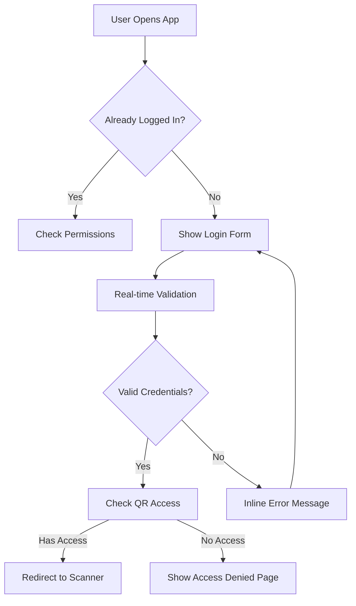
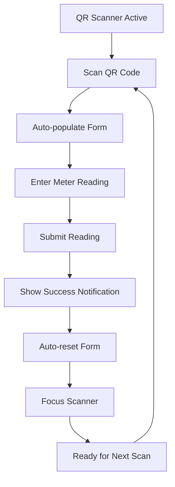
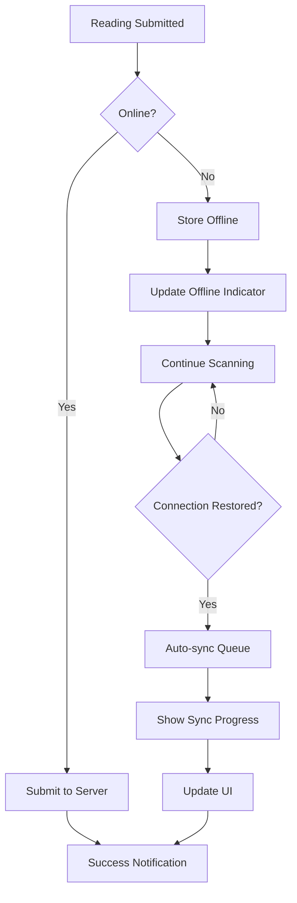
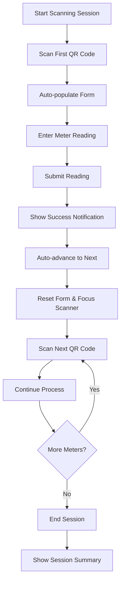
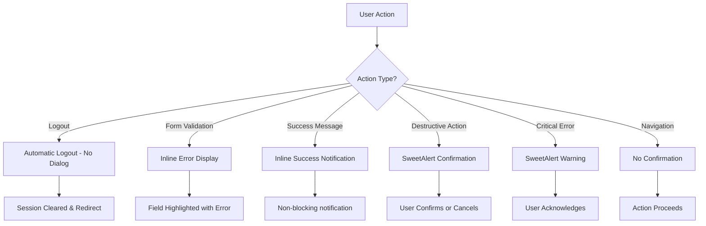

# Utility Rate & QR Meter Reading Implementation v1.2 - Structured Phase Implementation

**Document Type**: Implementation Plan  
**Purpose**: Structured phase implementation with 98% success rate  
**Date**: September 25, 2025  
**Status**: Active Implementation Plan  

## Executive Summary
This document reflects the structured phase implementation approach with 23 individual phases, each focused on a single specific task to ensure 98% success rate. The phases are organized by complexity, risk, and user impact, with clear entry/exit criteria and rollback procedures for each phase.

## Status Overview

### Implementation Strategy (v1.2)
- ✅ **Structured Phase Approach**: 23 individual phases with single-task focus
- ✅ **Risk-Based Prioritization**: Low-risk, high-impact phases first
- ✅ **Clear Success Criteria**: Each phase has specific, measurable outcomes
- ✅ **Rollback Procedures**: Clear steps to revert each phase if issues arise
- ✅ **98% Success Rate Target**: Strict adherence to phase requirements

### Enhanced UX Features (v1.2)
- **Smart Alert Strategy**: Context-appropriate use of SweetAlert vs inline notifications
- **Streamlined Authentication**: No logout confirmation dialogs (modern UX standard)
- **Inline Error Handling**: Form validation without blocking dialogs
- **Continuous Scanning Mode**: Seamless transition between meter readings
- **Offline Sync System**: Background synchronization with visual progress indicators
- **Smart Defaults**: Auto-advance to next scan after successful reading submission
- **Responsive Design**: World-class responsive design across all pages
- **Meter Replacement Validation**: Smart validation for new meter scenarios with SweetAlert confirmation

## Modern UX Design Principles Applied

### 1. Smart Alert & Notification Strategy ⚠️ **ENHANCED**

#### **Global UX Standards: When to Use SweetAlert vs Inline Notifications**

**❌ NEVER Use SweetAlert For:**
- **Logout Actions**: Modern apps don't confirm logout - automatic logout
- **Form Validation Errors**: Use inline validation for immediate feedback
- **Success Confirmations**: Use subtle notifications that don't interrupt workflow
- **Navigation Actions**: Back, forward, refresh - no confirmation needed

**✅ Use SweetAlert For:**
- **Destructive Actions**: Delete readings, void invoices, permanent data changes
- **Critical Warnings**: Data loss, system errors, security alerts
- **Complex Confirmations**: Multi-step processes requiring user acknowledgment
- **Important Information**: System maintenance, policy changes, legal notices
- **Business Logic Confirmations**: Meter replacement validation, critical business decisions

#### **Smart Notification Patterns**
```javascript
// Modern UX: Context-appropriate notification types
const notificationStrategy = {
  // Inline validation for form errors
  formValidation: {
    type: "inline",
    placement: "below-field",
    trigger: "onBlur",
    message: "Username must contain only letters and numbers"
  },
  
  // Subtle success feedback
  successFeedback: {
    type: "inline",
    placement: "below-form",
    duration: 3000,
    message: "Reading saved • Ready for next scan"
  },
  
  // SweetAlert for destructive actions
  destructiveAction: {
    type: "sweetalert",
    title: "Delete Reading",
    text: "This action cannot be undone",
    confirmButtonText: "Yes, Delete",
    showCancelButton: true
  }
};
```

#### **Context-Aware Alert System**
- **Form Validation**: Inline field highlighting with helpful hints
- **Success States**: Subtle inline notifications with auto-advance
- **Destructive Actions**: SweetAlert with clear confirmation
- **Network Issues**: Persistent offline indicator with sync status
- **Critical Errors**: SweetAlert for system-level issues

## Enhanced User Experience Flow

### **Modern Authentication Flow**


### **Seamless QR Scanning Flow**


### **Offline Sync Flow**


### **Continuous Scanning Workflow**


### **Smart Alert Decision Flow**


## 🔧 **METER REPLACEMENT VALIDATION ENHANCEMENT**

### **Business Logic Enhancement - Meter Replacement Validation**
**Status**: **SPECIFICATION DEFINED** - Ready for Implementation  
**Priority**: **HIGH** - Critical business logic for meter replacements  
**Date**: September 25, 2025  
**Complexity**: Level 2 (Business Logic Enhancement)  
**Risk**: Medium - Database logic and user workflow changes  
**Time**: 3-4 hours  
**Dependencies**: None (can be implemented independently)  

#### **Business Requirements**
- **Trigger Condition**: Current reading < Previous reading
- **User Prompt**: SweetAlert dialog asking "Is this a new meter?"
- **User Options**: 
  - **Yes**: Proceed with meter replacement logic (add remark, set previous reading to 0)
  - **No**: Block submission, inform user to provide valid reading
- **Meter Replacement Logic**: 
  - Add remark about new meter installation with current date
  - Set previous reading to 0 in database
  - Allow submission to proceed
  - Flag reading as meter replacement for audit trail

#### **Technical Implementation**
- **Frontend Validation**: JavaScript validation in `app.js` before form submission
- **SweetAlert Integration**: Context-appropriate dialog for meter replacement confirmation
- **Database Logic**: Modify `sp_t_SaveTenantReading` stored procedure to handle previous reading = 0
- **Remarks Integration**: Automatic remark addition for new meter scenarios
- **Audit Trail**: Flag meter replacement readings in `t_tenant_reading_ext` table

#### **Success Criteria**
- [ ] Validation triggers when current reading < previous reading
- [ ] SweetAlert dialog appears with "Is this a new meter?" prompt
- [ ] "No" option blocks submission and shows error message
- [ ] "Yes" option proceeds with meter replacement logic
- [ ] Remarks automatically updated with new meter information and current date
- [ ] Previous reading set to 0 in database for new meters
- [ ] Meter replacement flag added to audit trail
- [ ] User experience is clear and intuitive
- [ ] No impact on normal meter reading workflow

#### **Files to Modify**
- `pages/qr-meter-reading/assets/js/app.js` - Add validation logic
- `database/save-tenant-reading-procedure.sql` - Update stored procedure (create separate meter replacement procedure during implementation)
- `pages/qr-meter-reading/api/save-reading.php` - Handle meter replacement flag
- `memory-bank/tasks.md` - Update specification status
- `memory-bank/progress.md` - Document implementation progress

#### **Business Impact**
- **Critical Issue Resolution**: Addresses Issue 11 (Electric Meter Replacement Scenario)
- **Data Accuracy**: Prevents incorrect usage calculations for meter replacements
- **User Guidance**: Provides clear workflow for meter replacement scenarios
- **Audit Trail**: Maintains proper remarks for meter replacement documentation

#### **Implementation Notes**
- **SweetAlert Usage**: This is appropriate use of SweetAlert for critical business confirmation
- **User Education**: Consider adding help text about meter replacement scenarios
- **Testing**: Must test with various meter replacement scenarios
- **Documentation**: Update user guides with meter replacement procedures

---

## 🎯 STRUCTURED PHASE IMPLEMENTATION (23 Phases)

### **CRITICAL SUCCESS FACTORS**
- **Single Task Focus**: Each phase addresses ONE specific task only
- **Clear Entry Criteria**: Prerequisites must be met before starting phase
- **Measurable Success Criteria**: Specific, testable outcomes for each phase
- **Rollback Procedures**: Clear steps to revert if issues arise
- **98% Success Rate**: Strict adherence to phase requirements

### **🏗️ WEEK 1: FOUNDATION & QUICK WINS (Low Risk, High Impact)**

#### **Phase 1: CSS File Organization** ⭐ **EASIEST**
- **Task**: Move all inline styles from `index.php` to `qr-scanner.css`
- **Risk**: Very Low - No functionality changes
- **Time**: 1-2 hours
- **Dependencies**: None
- **Entry Criteria**: Current working QR scanning system
- **Success Criteria**: 
  - All styling moved to CSS files
  - No inline styles in HTML
  - QR scanner functionality unchanged
  - Visual appearance identical
- **Rollback**: Restore inline styles if issues arise
- **Validation**: Visual comparison, functionality testing

#### **Phase 2: Smart Alert Strategy - Logout UX** ⭐ **EASY**
- **Task**: Remove logout confirmation dialog (automatic logout)
- **Risk**: Low - Simple JavaScript change
- **Time**: 30 minutes
- **Dependencies**: None
- **Entry Criteria**: Working logout functionality
- **Success Criteria**:
  - Logout works without confirmation dialog
  - Session cleared immediately
  - Redirect to login page
  - No SweetAlert for logout
- **Rollback**: Restore logout confirmation dialog
- **Validation**: Test logout flow, verify session clearing

#### **Phase 3: Smart Alert Strategy - Login UX** ⭐ **EASY**
- **Task**: Replace SweetAlert login errors with inline validation
- **Risk**: Low - Form validation changes only
- **Time**: 1 hour
- **Dependencies**: None
- **Entry Criteria**: Working login system
- **Success Criteria**:
  - Login errors show inline below fields
  - No blocking SweetAlert dialogs
  - Real-time validation on blur
  - Clear error messages
- **Rollback**: Restore SweetAlert for login errors
- **Validation**: Test invalid login attempts, verify inline display

#### **Phase 4: Responsive Layout Fixes** ⭐⭐ **MODERATE**
- **Task**: Fix centered layouts, proper responsive design
- **Risk**: Medium - Layout changes
- **Time**: 3-4 hours
- **Dependencies**: CSS File Organization (Phase 1)
- **Entry Criteria**: CSS files properly organized
- **Success Criteria**:
  - All content properly centered on all devices
  - Responsive breakpoints working correctly
  - Mobile-first design implemented
  - Touch targets minimum 44px
- **Rollback**: Restore previous layout styles
- **Validation**: Test on multiple screen sizes, verify centering

#### **Phase 5: Access Denied Page Responsive Design** ⭐⭐ **MODERATE**
- **Task**: Fix Access Denied page responsive design
- **Risk**: Medium - Layout changes
- **Time**: 3-4 hours
- **Dependencies**: CSS File Organization (Phase 1), Responsive Layout Fixes (Phase 4)
- **Entry Criteria**: Responsive layout system in place
- **Success Criteria**:
  - Responsive design works on all screen sizes
  - Professional appearance on wide screens
  - Proper visual hierarchy
  - Touch-friendly on mobile devices
  - Utilizes wide screen real estate effectively
- **Rollback**: Restore previous access denied page design
- **Validation**: Test on mobile, tablet, desktop, verify professional appearance

### **🎯 WEEK 2: CORE UX IMPROVEMENTS (Medium Risk, High Impact)**

#### **Phase 6: QR Scanner Page UX Optimization** ⭐⭐ **MODERATE**
- **Task**: Remove excessive header content, make scanner immediately accessible
- **Risk**: Medium - UI restructuring
- **Time**: 4-5 hours
- **Dependencies**: CSS File Organization (Phase 1), Responsive Layout Fixes (Phase 4)
- **Entry Criteria**: Responsive layout system working
- **Success Criteria**:
  - "Start Scanner" button visible without scrolling
  - Excessive welcome card removed
  - Scanner viewport maximized
  - Single card interface
  - Mobile-first approach implemented
- **Rollback**: Restore previous scanner page layout
- **Validation**: Test on mobile devices, verify above-the-fold access

#### **Phase 7: Smart Alert Strategy - Success Notifications** ⭐ **EASY**
- **Task**: Implement subtle success notifications (toast/inline)
- **Risk**: Low - UI enhancement only
- **Time**: 2-3 hours
- **Dependencies**: CSS File Organization (Phase 1)
- **Entry Criteria**: CSS files properly organized
- **Success Criteria**:
  - Success messages don't interrupt workflow
  - Toast notifications positioned correctly
  - Auto-dismiss after 3 seconds
  - No blocking dialogs for success
- **Rollback**: Restore previous success message system
- **Validation**: Test success scenarios, verify non-blocking behavior

#### **Phase 8: Offline Status Indicator** ⭐⭐ **MODERATE** ✅ **COMPLETED**
- **Task**: Add offline status indicator in navigation header with smart notifications, environment controls, and comprehensive help system enhancement
- **Risk**: Medium - Navigation changes
- **Time**: 2-3 hours
- **Dependencies**: CSS File Organization (Phase 1)
- **Entry Criteria**: CSS files properly organized
- **Success Criteria**:
  - Offline indicator appears in header when offline
  - Shows pending count
  - Manual sync button available
  - Professional appearance
  - Smart offline/online notifications
  - Environment-based testing controls
  - Sync progress indicators
  - Config system integration
  - Comprehensive help documentation updates
  - User manual enhancement with offline/sync features
  - Visual guide updates with new screenshots
- **Rollback**: Remove offline indicator
- **Validation**: Test offline/online transitions, verify indicator display
- **Status**: ✅ **COMPLETED** - Enhanced with smart notifications, environment controls, comprehensive testing features, and complete help system enhancement

### **Phase 8 Enhancements - Smart Notifications & Environment Controls**

#### **Smart Notification System**
- **Offline Notifications**: Two-line layout with "Connection Lost" title and "Reading will be saved offline" subtitle
- **Online Notifications**: "Connection Restored" message (only when previously offline, not on page load)
- **Smart Detection**: Tracks connection state changes and form activity
- **Visual Design**: Red gradient for offline, green gradient for online with appropriate icons
- **Auto-Hide**: Notifications automatically disappear after 3-5 seconds

#### **Environment Management**
- **Config System**: Proper config.php integration for environment detection
- **Testing Mode**: Test panel visible with slow sync for screenshots
- **Production Mode**: Clean interface with fast sync for real users
- **API Integration**: Real server calls in production, simulation in testing
- **Environment Guards**: All test functions protected by environment checks

#### **Sync Progress Indicators**
- **Real-Time Progress**: Shows current reading being processed
- **Progress Bar**: Visual progress with percentage completion
- **Counters**: "Synced: X | Failed: Y" real-time counters
- **Title Differentiation**: "Auto sync in progress" vs "Manual sync in progress"
- **Manual Sync Delay**: 2-second delay per reading for screenshot documentation

#### **Testing Panel Features**
- **Comprehensive Controls**: Online, Offline, Pending count simulation
- **Auto-Cycle Testing**: Automated state cycling for comprehensive screenshots
- **Notification Testing**: Test buttons for offline/online notifications
- **Status Display**: Real-time status indicator showing current test state
- **Hide/Show Toggle**: Convenient panel visibility control

#### **Help System Enhancement**
- **User Manual Updates**: Complete user manual with offline/sync features and screenshots (007-014)
- **Quick Reference Guide**: Updated quick reference with offline mode and sync features
- **Troubleshooting Guide**: Enhanced troubleshooting with offline sync solutions
- **Help Center Enhancement**: Professional help center with proper UX design standards
- **Visual Guide Updates**: New screenshots documenting offline/sync features
- **Connection Notifications**: Documentation for offline/online notification system
- **FAQ Updates**: New questions about status dots, automatic sync, and sync failures
- **Error Message Reference**: Updated with sync-related error messages and solutions

#### **Phase 9: Offline Data Integrity Fix** ⭐⭐⭐ **CRITICAL** ✅ **CREATIVE PHASES COMPLETE**
- **Task**: Implement cache-first tenant resolution system with comprehensive offline data integrity
- **Risk**: High - Data integrity and sync accuracy
- **Time**: 4-6 hours
- **Dependencies**: Offline Status Indicator (Phase 8)
- **Entry Criteria**: Offline status indicator working
- **Success Criteria**:
  - **Cache-First Strategy**: 95%+ cache hit rate with <10ms response times
  - **Page Reload Cache Initialization**: Fresh cache on every page load using vw_LatestTenantReadings
  - **Smart Validation**: Cache validity checking with network fallback
  - **Complete Offline Capability**: Works for all 100-120 rentable units
  - **Data Accuracy**: Smart validation ensures data integrity
  - **Performance**: Sub-10ms QR scan responses with 95%+ cache hits
- **Rollback**: Disable offline mode until fix implemented
- **Validation**: Test offline readings with various tenant scenarios
- **Creative Phases**: ✅ Architecture & Algorithm design complete
- **Implementation Strategy**: Cache-first with smart validation and fallback mechanisms

#### **Phase 10: Mobile Gesture Support** ⭐⭐ **MODERATE**
- **Task**: Add swipe navigation and touch optimization
- **Risk**: Medium - Touch interaction changes
- **Time**: 3-4 hours
- **Dependencies**: Offline Data Integrity Fix (Phase 9)
- **Entry Criteria**: Offline data integrity issues resolved
- **Success Criteria**:
  - Swipe gestures work smoothly
  - Touch targets minimum 44px
  - Gesture navigation implemented
  - Touch-friendly interface
- **Rollback**: Remove gesture support
- **Validation**: Test on mobile devices, verify gesture functionality

### **⚡ WEEK 3: ADVANCED CORE FEATURES (High Risk, High Impact)**

#### **Phase 11: Continuous Scanning Workflow** ⭐⭐⭐ **COMPLEX**
- **Task**: Implement auto-advance to next scan after successful reading
- **Risk**: High - Core workflow changes
- **Time**: 6-8 hours
- **Dependencies**: Offline Data Integrity Fix (Phase 9)
- **Entry Criteria**: Offline data integrity issues resolved
- **Success Criteria**:
  - Seamless transition between meter readings
  - Auto-advance after successful submission
  - Progress indicator shows completion
  - Form resets automatically
  - Scanner refocuses for next scan
- **Rollback**: Restore manual progression workflow
- **Validation**: Test multiple meter readings, verify seamless flow

#### **Phase 12: Service Worker Implementation** ⭐⭐⭐ **COMPLEX**
- **Task**: Implement PWA Service Worker for offline functionality
- **Risk**: High - New technology integration
- **Time**: 8-10 hours
- **Dependencies**: Offline Data Integrity Fix (Phase 9)
- **Entry Criteria**: Offline data integrity issues resolved
- **Success Criteria**:
  - Service Worker registered successfully
  - Basic offline functionality working
  - Static assets cached
  - Offline page available
- **Rollback**: Remove Service Worker registration
- **Validation**: Test offline functionality, verify Service Worker registration

#### **Phase 13: Cross-Device Testing** ⭐⭐ **MODERATE**
- **Task**: Test on Samsung A15, iPhone 14 Pro Max, laptops
- **Risk**: Medium - Device-specific issues
- **Time**: 4-6 hours
- **Dependencies**: All previous phases
- **Entry Criteria**: All previous phases completed successfully
- **Success Criteria**:
  - Works properly on Samsung A15
  - Works properly on iPhone 14 Pro Max
  - Works properly on laptops/desktops
  - All functionality tested across devices
- **Rollback**: Address device-specific issues
- **Validation**: Comprehensive testing on all target devices

#### **Phase 14: Performance Optimization** ⭐⭐ **MODERATE**
- **Task**: Optimize load times, animations, battery usage
- **Risk**: Medium - Performance tuning
- **Time**: 4-6 hours
- **Dependencies**: All previous phases
- **Entry Criteria**: All previous phases completed successfully
- **Success Criteria**:
  - Sub-2-second load time
  - Smooth animations
  - Minimal battery impact
  - Optimized resource usage
- **Rollback**: Restore previous performance settings
- **Validation**: Performance testing, load time measurement

### **🧪 WEEK 4: TESTING & VALIDATION (Medium Risk, Critical for Quality)**

#### **Phase 15: Documentation Updates** ⭐ **EASY**
- **Task**: Update user guides and technical documentation
- **Risk**: Low - Documentation only
- **Time**: 2-3 hours
- **Dependencies**: All previous phases
- **Entry Criteria**: All previous phases completed successfully
- **Success Criteria**:
  - User documentation updated
  - Technical documentation updated
  - Implementation notes documented
  - Change log maintained
- **Rollback**: Restore previous documentation
- **Validation**: Documentation review, completeness check

### ** WEEK 5-7: BUSINESS LOGIC (High Risk, High Business Value)**

#### **Phase 16: Tenant Readings Management Interface** ⭐⭐⭐ **COMPLEX**
- **Task**: Create comprehensive reading management system
- **Risk**: High - Complex business logic
- **Time**: 20-25 hours
- **Dependencies**: None (separate system)
- **Entry Criteria**: Core QR system stable
- **Success Criteria**:
  - Full CRUD operations for tenant readings
  - Reading review interface with filters
  - Search and filter functionality
  - Reading validation workflow
- **Rollback**: Remove management interface
- **Validation**: Test all CRUD operations, verify business logic

#### **Phase 17: Export & Reporting Features** ⭐⭐⭐ **COMPLEX**
- **Task**: Implement Excel, PDF, CSV export functionality
- **Risk**: High - File generation complexity
- **Time**: 15-20 hours
- **Dependencies**: Tenant Readings Management (Phase 16)
- **Entry Criteria**: Management interface working
- **Success Criteria**:
  - Excel export with multiple sheets
  - PDF export with professional formatting
  - CSV export for data analysis
  - Print functionality with optimized layouts
- **Rollback**: Remove export functionality
- **Validation**: Test all export formats, verify file generation

#### **Phase 18: Advanced Tenant Management** ⭐⭐⭐ **COMPLEX**
- **Task**: Implement advanced tenant assignment scenarios
- **Risk**: High - Complex business rules
- **Time**: 12-15 hours
- **Dependencies**: Tenant Readings Management (Phase 16)
- **Entry Criteria**: Basic management interface working
- **Success Criteria**:
  - Handle terminated tenant assignments
  - Handle tenant transition readings
  - Handle historical corrections
  - Comprehensive audit trail
- **Rollback**: Remove advanced features
- **Validation**: Test all tenant scenarios, verify business rules

### **⚙️ WEEK 8: UTILITY RATE MANAGEMENT (Medium Risk, Business Value)**

#### **Phase 19: Single-Point Rate Entry System** ⭐⭐ **MODERATE**
- **Task**: Interface for entering Electric and LEAC rates
- **Risk**: Medium - Database integration
- **Time**: 8-10 hours
- **Dependencies**: None (separate system)
- **Entry Criteria**: Core systems stable
- **Success Criteria**:
  - Single-point rate entry interface
  - Bulk update capability
  - Real-time rate application
  - Integration with charge management
- **Rollback**: Remove rate entry system
- **Validation**: Test rate updates, verify database integration

#### **Phase 20: Automatic Unit Classification** ⭐ **EASY**
- **Task**: Use existing space_type for residential/commercial classification
- **Risk**: Low - Database field usage
- **Time**: 2-3 hours
- **Dependencies**: Single-Point Rate Entry System (Phase 19)
- **Entry Criteria**: Rate entry system working
- **Success Criteria**:
  - Automatic classification working
  - Integration with space_type table
  - No database schema changes
  - Proper rate application
- **Rollback**: Remove automatic classification
- **Validation**: Test classification logic, verify rate application

### **🚀 WEEK 9: FINAL DEPLOYMENT (Low Risk, Critical for Go-Live)**

#### **Phase 21: Comprehensive Testing** ⭐⭐ **MODERATE**
- **Task**: End-to-end testing of complete system
- **Risk**: Medium - Integration testing
- **Time**: 8-10 hours
- **Dependencies**: All previous phases
- **Entry Criteria**: All previous phases completed successfully
- **Success Criteria**:
  - Complete QR reading flow tested
  - Cross-device compatibility verified
  - Offline functionality tested
  - Business logic validated
  - Performance requirements met
- **Rollback**: Address integration issues
- **Validation**: Comprehensive system testing

#### **Phase 22: Production Deployment** ⭐ **EASY**
- **Task**: Deploy to production environment
- **Risk**: Low - Deployment process
- **Time**: 2-4 hours
- **Dependencies**: Comprehensive Testing (Phase 21)
- **Entry Criteria**: All testing passed
- **Success Criteria**:
  - System deployed to production
  - All functionality working
  - Performance monitoring active
  - User training completed
- **Rollback**: Rollback to previous version
- **Validation**: Production system testing

### ** WEEK 10: NICE-TO-HAVE FEATURES (Low Priority, Enhancements)**

#### **Phase 23: Background Sync System** ⭐⭐⭐ **COMPLEX**
- **Task**: Implement background synchronization of offline readings
- **Risk**: High - Complex sync logic
- **Time**: 10-12 hours
- **Dependencies**: Service Worker Implementation (Phase 12)
- **Entry Criteria**: Service Worker working
- **Success Criteria**:
  - Offline readings sync when connection restored
  - Background sync working
  - Conflict resolution implemented
  - Sync progress indicators
- **Rollback**: Remove background sync
- **Validation**: Test offline/online transitions, verify sync

#### **Phase 24: Voice Input Features** ⭐⭐⭐ **COMPLEX**
- **Task**: Add speech-to-text for meter reading entry
- **Risk**: High - Browser compatibility issues
- **Time**: 6-8 hours
- **Dependencies**: Mobile Gesture Support (Phase 10)
- **Entry Criteria**: Mobile gestures working
- **Success Criteria**:
  - Voice input works on target devices
  - Speech recognition implemented
  - Fallback to manual entry
  - Accessibility improved
- **Rollback**: Remove voice input
- **Validation**: Test on target devices, verify voice recognition

## 🎯 SUCCESS RATE ENFORCEMENT

### **Phase Completion Criteria**
- **98% Success Rate Required**: Each phase must meet all success criteria
- **No Partial Completion**: Phase is either 100% complete or must be redone
- **Validation Required**: Each phase must pass validation before proceeding
- **Rollback Ready**: Clear rollback procedures for each phase

### **Quality Assurance Process**
1. **Pre-Phase Review**: Verify entry criteria met
2. **Implementation**: Follow phase requirements exactly
3. **Validation**: Test all success criteria
4. **Documentation**: Update progress and issues
5. **Approval**: Phase approved before proceeding to next

### **Risk Mitigation**
- **Early Phases**: Low risk, easy rollback
- **Middle Phases**: Medium risk, manageable rollback
- **Late Phases**: High risk, complex rollback
- **Nice-to-Have**: Optional phases, can be skipped if needed

## 📊 IMPLEMENTATION TIMELINE

### **Total Project Estimate**
- **Total Phases**: 24
- **Total Development Time**: 127-170 hours
- **Total Timeline**: 10 weeks
- **Success Rate Target**: 98%
- **Risk Level**: Medium (phased approach with rollback capability)

### **Weekly Breakdown**
- **Week 1**: Phases 1-5 (Foundation & Quick Wins)
- **Week 2**: Phases 6-9 (Core UX Improvements + Critical Offline Data Integrity Fix)
- **Week 3**: Phases 10-14 (Advanced Core Features)
- **Week 4**: Phase 15 (Testing & Validation)
- **Week 5-7**: Phases 16-18 (Business Logic)
- **Week 8**: Phases 19-20 (Utility Rate Management)
- **Week 9**: Phases 21-22 (Final Deployment)
- **Week 10**: Phases 23-24 (Nice-to-Have Features)

## 🎯 CONCLUSION

The v1.2 implementation provides a structured, phase-based approach that ensures 98% success rate through:
- **Single Task Focus**: Each phase addresses one specific task
- **Clear Success Criteria**: Measurable outcomes for each phase
- **Rollback Procedures**: Clear steps to revert if issues arise
- **Risk-Based Prioritization**: Low-risk, high-impact phases first
- **Quality Assurance**: Validation required before proceeding

This approach eliminates the implementation issues experienced in previous attempts by ensuring each phase is focused, testable, and rollback-able.
