# Creative Phase: Offline Data Integrity Fix - Phase 9

**Document Type**: Creative Phase Documentation  
**Purpose**: Design decisions for Phase 9 Offline Data Integrity Fix  
**Date**: September 25, 2025  
**Status**: Complete - Ready for Implementation Mode  
**Phase**: Phase 9 - Offline Data Integrity Fix  

## 🎨 CREATIVE PHASE OVERVIEW

**Focus**: Phase 9 - Offline Data Integrity Fix  
**Objective**: Design offline tenant resolution system and data validation algorithms  
**Requirements**: Fix critical bug with tenant previous reading retrieval during offline mode  

### **CREATIVE PHASES COMPLETED**

1. **🏗️ Architecture Design Phase** - Complex offline data architecture
2. **⚙️ Algorithm Design Phase** - Complex data validation algorithms

---

## 🏗️ ARCHITECTURE DESIGN PHASE

### **PROBLEM STATEMENT**

**Current Architecture Issue**: The existing offline mode implementation has a critical flaw where `storeOfflineReading()` only stores basic form data without proper tenant resolution and previous reading validation. This leads to:

1. **Incorrect Tenant Data**: Offline readings stored without proper tenant resolution
2. **Missing Previous Readings**: No previous reading retrieval during offline mode
3. **Data Integrity Issues**: Sync process propagates incorrect data to server
4. **No Validation Pipeline**: Missing data validation before offline storage

### **ARCHITECTURE OPTIONS ANALYSIS**

#### **Option 1: Client-Side Tenant Resolution with Caching**
**Description**: Implement tenant resolution logic in JavaScript with cached tenant data
**Pros**:
- Fast offline operation (no server calls needed)
- Reduces server load during offline mode
- Immediate tenant resolution
- Works completely offline once cached

**Cons**:
- Complex client-side logic
- Cache invalidation challenges
- Potential data staleness issues
- Larger JavaScript bundle size

**Complexity**: High  
**Implementation Time**: 6-8 hours

#### **Option 2: Hybrid Online/Offline Tenant Resolution**
**Description**: Use cached data when available, fallback to server when online, graceful degradation when offline
**Pros**:
- Best of both worlds (accuracy + offline capability)
- Graceful degradation for edge cases
- Maintains data freshness when possible
- Flexible architecture

**Cons**:
- More complex implementation
- Multiple code paths to maintain
- Potential inconsistency between online/offline behavior
- Complex error handling

**Complexity**: High  
**Implementation Time**: 8-10 hours

#### **Option 3: Server-Side Validation with Offline Queue Enhancement**
**Description**: Enhance offline queue with validation metadata and server-side validation during sync
**Pros**:
- Centralized validation logic
- Consistent validation rules
- Simpler client-side implementation
- Better data integrity guarantees

**Cons**:
- Requires online connection for validation
- Delayed validation (only during sync)
- Potential sync failures due to validation errors
- Less responsive offline experience

**Complexity**: Medium  
**Implementation Time**: 4-6 hours

### **ARCHITECTURE DECISION**

**Chosen Option**: **Option 2 - Hybrid Online/Offline Tenant Resolution**

**Rationale**: 
- Provides the best balance of data accuracy and offline capability
- Ensures data integrity while maintaining responsive offline experience
- Allows for graceful degradation when cached data is unavailable
- Provides multiple fallback mechanisms for robust operation

### **IMPLEMENTATION ARCHITECTURE**

```mermaid
graph TD
    subgraph "OFFLINE DATA INTEGRITY ARCHITECTURE"
        A[QR Scan] --> B[Extract Property/Unit]
        B --> C{Online?}
        
        C -->|Yes| D[Server Tenant Resolution]
        C -->|No| E[Client Tenant Resolution]
        
        D --> F[Cache Tenant Data]
        E --> G{Cached Data<br>Available?}
        
        G -->|Yes| H[Use Cached Data]
        G -->|No| I[Fallback Resolution]
        
        F --> J[Validate Data]
        H --> J
        I --> J
        
        J --> K{Validation<br>Passed?}
        K -->|Yes| L[Store Offline Reading]
        K -->|No| M[Show Error & Block]
        
        L --> N[Sync Queue]
        N --> O[Sync Process]
        O --> P[Server Validation]
        P --> Q{Sync<br>Success?}
        Q -->|Yes| R[Remove from Queue]
        Q -->|No| S[Retry Logic]
    end
    
    style A fill:#4da6ff,stroke:#0066cc,color:white
    style D fill:#4dbb5f,stroke:#36873f,color:white
    style E fill:#ffa64d,stroke:#cc7a30,color:white
    style J fill:#d94dbb,stroke:#a3378a,color:white
    style L fill:#4dbbbb,stroke:#368787,color:white
    style P fill:#d971ff,stroke:#a33bc2,color:white
```



### **COMPONENT ARCHITECTURE**

#### **1. Tenant Resolution Service**
```javascript
class TenantResolutionService {
    // Online tenant resolution with caching
    async resolveTenantOnline(propertyCode, unitNo)
    
    // Offline tenant resolution with fallbacks
    resolveTenantOffline(propertyCode, unitNo)
    
    // Cache management
    cacheTenantData(tenantData)
    getCachedTenantData(propertyCode, unitNo)
    
    // Fallback resolution strategies
    resolveTenantFallback(propertyCode, unitNo)
}
```

#### **2. Data Validation Pipeline**
```javascript
class DataValidationPipeline {
    // Validation stages
    validateTenantData(tenantData)
    validatePreviousReading(readingData)
    validateDataIntegrity(offlineReading)
    
    // Validation rules
    validateTenantExists(tenantCode)
    validateReadingConsistency(currentReading, prevReading)
    validateDataCompleteness(readingData)
}
```

#### **3. Enhanced Offline Storage**
```javascript
class EnhancedOfflineStorage {
    // Enhanced storage with validation metadata
    storeOfflineReading(readingData, validationMetadata)
    
    // Data integrity tracking
    addValidationMetadata(readingData)
    trackDataIntegrity(readingData)
    
    // Sync preparation
    prepareForSync(offlineReadings)
    validateBeforeSync(offlineReadings)
}
```

### **CACHING STRATEGY**

#### **Cache Structure**
```javascript
// localStorage key: 'qr_tenant_cache'
{
    "GCA": {
        "101": {
            tenantCode: "T001",
            tenantName: "John Doe",
            lastUpdated: "2025-09-25T10:30:00Z",
            expiresAt: "2025-09-26T10:30:00Z"
        }
    }
}
```

#### **Cache Management**
- **Cache Duration**: 24 hours
- **Cache Invalidation**: On tenant changes, manual refresh
- **Cache Strategy**: LRU with size limits
- **Cache Validation**: Timestamp-based expiration

### **FALLBACK RESOLUTION STRATEGIES**

1. **Primary**: Use cached tenant data
2. **Secondary**: Use last known tenant from offline readings
3. **Tertiary**: Use property/unit defaults
4. **Final**: Block reading with clear error message

---

## ⚙️ ALGORITHM DESIGN PHASE

### **PROBLEM STATEMENT**

**Algorithm Challenges**: The offline data integrity fix requires sophisticated algorithms to handle:

1. **Tenant Resolution Fallback Logic**: Multiple strategies for resolving tenant data when offline
2. **Previous Reading Validation**: Ensuring previous reading accuracy and consistency
3. **Data Integrity Validation**: Comprehensive validation before offline storage and during sync
4. **Sync Process Validation**: Ensuring data integrity during synchronization

### **ALGORITHM OPTIONS ANALYSIS**

#### **Option 1: Sequential Fallback Algorithm**
**Description**: Try tenant resolution strategies in sequence until one succeeds
**Pros**:
- Simple to implement and understand
- Predictable behavior
- Easy to debug and maintain
- Clear failure points

**Cons**:
- May be slow if early strategies fail
- No parallel optimization
- Rigid order of fallback strategies
- Limited flexibility

**Complexity**: Low  
**Performance**: Medium (sequential execution)

#### **Option 2: Parallel Resolution with Priority Scoring**
**Description**: Run multiple resolution strategies in parallel and score results by priority
**Pros**:
- Faster resolution (parallel execution)
- Flexible priority system
- Can combine results from multiple sources
- Optimized for performance

**Cons**:
- More complex implementation
- Potential race conditions
- Resource intensive
- Complex scoring logic

**Complexity**: High  
**Performance**: High (parallel execution)

#### **Option 3: Intelligent Caching with Predictive Resolution**
**Description**: Use machine learning-like approach to predict best resolution strategy
**Pros**:
- Optimized for specific usage patterns
- Learns from previous resolutions
- Potentially fastest resolution
- Adaptive to user behavior

**Cons**:
- Very complex implementation
- Requires training data
- May not work well for new properties/tenants
- Over-engineering for current needs

**Complexity**: Very High  
**Performance**: High (after learning period)

### **ALGORITHM DECISION**

**Chosen Option**: **Option 1 - Sequential Fallback Algorithm**

**Rationale**: 
- Provides reliable, predictable behavior for critical data integrity
- Simple to implement, test, and maintain
- Clear failure points for debugging
- Appropriate complexity for the current requirements
- Can be enhanced later if needed

### **TENANT RESOLUTION FALLBACK ALGORITHM**

```javascript
async resolveTenantWithFallback(propertyCode, unitNo) {
    const strategies = [
        this.resolveFromCache.bind(this),
        this.resolveFromOfflineHistory.bind(this),
        this.resolveFromDefaults.bind(this),
        this.resolveFromServer.bind(this)
    ];
    
    for (let i = 0; i < strategies.length; i++) {
        try {
            const result = await strategies[i](propertyCode, unitNo);
            if (result && this.validateTenantResult(result)) {
                return result;
            }
        } catch (error) {
            console.warn(`Strategy ${i + 1} failed:`, error);
            continue;
        }
    }
    
    throw new Error('All tenant resolution strategies failed');
}
```

#### **Strategy 1: Cache Resolution**
```javascript
resolveFromCache(propertyCode, unitNo) {
    const cacheKey = `${propertyCode}_${unitNo}`;
    const cached = this.tenantCache.get(cacheKey);
    
    if (cached && !this.isCacheExpired(cached)) {
        return {
            tenantCode: cached.tenantCode,
            tenantName: cached.tenantName,
            source: 'cache',
            confidence: 0.9
        };
    }
    
    return null;
}
```

#### **Strategy 2: Offline History Resolution**
```javascript
resolveFromOfflineHistory(propertyCode, unitNo) {
    const offlineReadings = this.getOfflineReadings();
    const recentReading = offlineReadings
        .filter(r => r.propertyCode === propertyCode && r.unitNo === unitNo)
        .sort((a, b) => new Date(b.timestamp) - new Date(a.timestamp))[0];
    
    if (recentReading && recentReading.tenantCode) {
        return {
            tenantCode: recentReading.tenantCode,
            tenantName: recentReading.tenantName,
            source: 'offline_history',
            confidence: 0.7
        };
    }
    
    return null;
}
```

#### **Strategy 3: Default Resolution**
```javascript
resolveFromDefaults(propertyCode, unitNo) {
    // Use property defaults or unit-specific defaults
    const defaults = this.getPropertyDefaults(propertyCode);
    
    if (defaults && defaults.defaultTenant) {
        return {
            tenantCode: defaults.defaultTenant,
            tenantName: 'Default Tenant',
            source: 'defaults',
            confidence: 0.3
        };
    }
    
    return null;
}
```

#### **Strategy 4: Server Resolution**
```javascript
async resolveFromServer(propertyCode, unitNo) {
    if (!this.isOnline) {
        throw new Error('Server resolution requires online connection');
    }
    
    const response = await fetch('/api/get-tenant-data.php', {
        method: 'POST',
        headers: { 'Content-Type': 'application/json' },
        body: JSON.stringify({ propertyCode, unitNo })
    });
    
    if (response.ok) {
        const data = await response.json();
        return {
            tenantCode: data.tenantCode,
            tenantName: data.tenantName,
            source: 'server',
            confidence: 1.0
        };
    }
    
    throw new Error('Server resolution failed');
}
```

### **PREVIOUS READING VALIDATION ALGORITHM**

```javascript
async validatePreviousReading(propertyCode, unitNo, currentReading) {
    const validationSteps = [
        this.validateReadingConsistency.bind(this),
        this.validateReadingRange.bind(this),
        this.validateReadingHistory.bind(this),
        this.validateReadingLogic.bind(this)
    ];
    
    const validationResults = [];
    
    for (const step of validationSteps) {
        try {
            const result = await step(propertyCode, unitNo, currentReading);
            validationResults.push(result);
        } catch (error) {
            validationResults.push({
                step: step.name,
                valid: false,
                error: error.message
            });
        }
    }
    
    return this.aggregateValidationResults(validationResults);
}
```

#### **Validation Step 1: Reading Consistency**
```javascript
async validateReadingConsistency(propertyCode, unitNo, currentReading) {
    const prevReading = await this.getPreviousReading(propertyCode, unitNo);
    
    if (prevReading === null) {
        return { valid: true, message: 'First reading for this unit' };
    }
    
    if (currentReading < prevReading) {
        return {
            valid: false,
            message: 'Current reading is less than previous reading',
            requiresMeterReplacement: true
        };
    }
    
    const usage = currentReading - prevReading;
    if (usage > this.getMaxExpectedUsage(propertyCode, unitNo)) {
        return {
            valid: false,
            message: 'Usage exceeds maximum expected range',
            requiresReview: true
        };
    }
    
    return { valid: true, message: 'Reading consistency validated' };
}
```

### **DATA INTEGRITY VALIDATION ALGORITHM**

```javascript
async validateDataIntegrity(offlineReading) {
    const integrityChecks = [
        this.validateRequiredFields.bind(this),
        this.validateDataTypes.bind(this),
        this.validateBusinessRules.bind(this),
        this.validateConsistency.bind(this)
    ];
    
    const results = [];
    
    for (const check of integrityChecks) {
        const result = await check(offlineReading);
        results.push(result);
        
        if (!result.valid) {
            return {
                valid: false,
                errors: results.filter(r => !r.valid),
                message: 'Data integrity validation failed'
            };
        }
    }
    
    return {
        valid: true,
        message: 'Data integrity validated',
        checks: results
    };
}
```

### **SYNC PROCESS VALIDATION ALGORITHM**

```javascript
async validateSyncProcess(offlineReadings) {
    const syncValidationSteps = [
        this.validateSyncReadiness.bind(this),
        this.validateDataConsistency.bind(this),
        this.validateServerCompatibility.bind(this),
        this.validateSyncOrder.bind(this)
    ];
    
    const validationResults = [];
    
    for (const step of syncValidationSteps) {
        const result = await step(offlineReadings);
        validationResults.push(result);
        
        if (!result.valid) {
            return {
                valid: false,
                step: step.name,
                error: result.message,
                canRetry: result.canRetry || false
            };
        }
    }
    
    return {
        valid: true,
        message: 'Sync process validated',
        readyForSync: true
    };
}
```

---

## 📋 IMPLEMENTATION GUIDELINES

### **Phase 1: Tenant Resolution Service**
1. Create `TenantResolutionService` class
2. Implement online tenant resolution with caching
3. Implement offline tenant resolution with fallbacks
4. Add cache management functionality

### **Phase 2: Data Validation Pipeline**
1. Create `DataValidationPipeline` class
2. Implement tenant data validation
3. Implement previous reading validation
4. Add data integrity checks

### **Phase 3: Enhanced Offline Storage**
1. Enhance `storeOfflineReading()` method
2. Add validation metadata to offline records
3. Implement sync preparation logic
4. Add data integrity tracking

### **Phase 4: Algorithm Implementation**
1. Implement tenant resolution fallback algorithm
2. Implement previous reading validation algorithm
3. Implement data integrity validation algorithm
4. Implement sync process validation algorithm

---

## ✅ VERIFICATION CHECKPOINT

### **Architecture Requirements Met**
- ✅ **Offline Tenant Resolution**: Hybrid approach with caching and fallbacks
- ✅ **Data Validation Pipeline**: Multi-stage validation before offline storage
- ✅ **Sync Process Enhancement**: Validation during sync with rollback capability
- ✅ **Mobile Compatibility**: Responsive design for Samsung A15 and iPhone 14 Pro Max
- ✅ **Error Handling**: Graceful degradation and clear error messages

### **Algorithm Requirements Met**
- ✅ **Tenant Resolution Fallback**: Sequential fallback algorithm with 4 strategies
- ✅ **Previous Reading Validation**: Multi-step validation with consistency checks
- ✅ **Data Integrity Validation**: Comprehensive validation pipeline
- ✅ **Sync Process Validation**: Pre-sync validation with connection stability
- ✅ **Performance Optimization**: Efficient algorithms with clear complexity analysis

### **Technical Feasibility**
- **Architecture**: High - Uses existing technologies and patterns
- **Algorithms**: High - Well-defined algorithms with clear implementation paths
- **Risk Assessment**: Medium - Complex implementation but well-defined fallbacks
- **Scalability**: High - Caching strategy supports multiple users and properties
- **Maintainability**: High - Clear, well-documented design with modular approach

---

## 🎯 CREATIVE DECISIONS SUMMARY

### **Key Architecture Decisions**
1. **Hybrid Online/Offline Tenant Resolution**: Best balance of accuracy and offline capability
2. **Multi-Stage Data Validation Pipeline**: Comprehensive validation before offline storage
3. **Enhanced Offline Storage**: Validation metadata and sync preparation
4. **Caching Strategy**: 24-hour cache with LRU eviction and fallback mechanisms

### **Key Algorithm Decisions**
1. **Sequential Fallback Algorithm**: Predictable behavior for critical data integrity
2. **Multi-Step Validation**: Comprehensive validation with clear failure points
3. **Graceful Error Handling**: Clear error messages and retry logic
4. **Performance Optimization**: Efficient algorithms with clear complexity analysis

### **Implementation Readiness**
- ✅ **Architecture Design**: Complete with component specifications
- ✅ **Algorithm Design**: Complete with implementation guidelines
- ✅ **Error Handling**: Comprehensive error handling strategy
- ✅ **Testing Strategy**: Clear testing approach for validation
- ✅ **Documentation**: Complete implementation guidelines

---

## 🚀 NEXT STEPS

**Ready for Implementation Mode**: All creative phases completed with comprehensive design decisions and implementation guidelines.

**Implementation Mode Requirements**:
- Load creative design decisions from this document
- Follow implementation guidelines for each phase
- Implement tenant resolution service with caching
- Implement data validation pipeline
- Enhance offline storage with validation metadata
- Implement comprehensive error handling

**Type `IMPLEMENT` to begin implementation phase**
