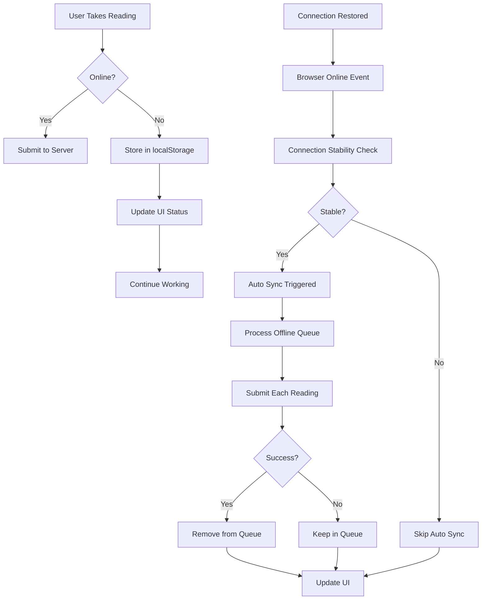

# Sync Functionality Documentation - QR Meter Reading System

**Document Type**: Technical Documentation  
**Purpose**: Complete sync functionality implementation guide  
**Date**: September 25, 2025  
**Status**: Production Ready - Enhanced with Intermittent Connection Handling, Smart Notifications, and Environment Controls  
**Version**: 3.0 - Robust Offline-First Sync with Smart Notifications and Environment Management  

## 📋 OVERVIEW

The QR Meter Reading System implements a robust offline-first sync mechanism that allows field technicians to continue working without internet connectivity. Readings are stored locally and automatically synced when connection is restored, with manual sync options available.

### **Key Features**
- **Offline-First Architecture**: Continue working without internet connectivity
- **Connection Stability Check**: Prevents data loss during intermittent connections
- **Manual & Automatic Sync**: User-controlled and automatic synchronization
- **Duplicate Prevention**: Unique sync IDs prevent duplicate submissions
- **Real-Time Status Indicators**: Visual feedback for sync state
- **Robust Error Handling**: Graceful handling of network issues
- **Mobile Optimized**: Touch-friendly interface for field technicians
- **Smart Notifications**: Context-aware offline/online notifications
- **Environment Controls**: Testing vs production mode management
- **Sync Progress Indicators**: Real-time visual feedback for sync operations
- **Config System Integration**: Proper environment configuration management
- **Help System Enhancement**: Comprehensive help documentation with offline/sync features
- **User Manual Updates**: Complete user manual with new Phase 8 features and screenshots
- **Visual Guide Updates**: New screenshots (007-014) documenting offline/sync features

## 🔄 SYNC ARCHITECTURE

### **Core Components**
- **Offline Queue**: localStorage-based storage for pending readings
- **Sync Engine**: Handles both manual and automatic synchronization
- **Connection Stability Checker**: Verifies stable connection before auto-sync
- **Status Indicators**: Visual feedback for sync state (avatar badges)
- **Duplicate Prevention**: Unique sync IDs prevent duplicate submissions
- **Ping Endpoint**: Lightweight connection testing (`api/ping.php`)

### **Data Flow**


## 🌐 CONNECTION STABILITY SYSTEM

### **Ping Endpoint**
The system includes a lightweight ping endpoint for connection testing:

```php
// api/ping.php - Lightweight connection test
<?php
header('Content-Type: application/json');
header('Cache-Control: no-cache, no-store, must-revalidate');
header('Pragma: no-cache');
header('Expires: 0');

http_response_code(200);
echo json_encode([
    'status' => 'ok',
    'timestamp' => date('Y-m-d H:i:s'),
    'server' => 'QR Meter Reading System'
]);
?>
```

### **Connection Testing Parameters**
- **Method**: HEAD request (minimal data transfer)
- **Timeout**: 2 seconds per ping request
- **Cache**: Disabled to ensure fresh connection test
- **Response**: Simple JSON with timestamp

### **Stability Check Algorithm**
```javascript
async waitForStableConnection() {
    const STABILITY_CHECK_DURATION = 3000; // 3 seconds
    const PING_INTERVAL = 500; // Check every 500ms
    const REQUIRED_SUCCESS_COUNT = 3; // Need 3 successful pings
    
    return new Promise((resolve, reject) => {
        let successCount = 0;
        let checkCount = 0;
        const maxChecks = STABILITY_CHECK_DURATION / PING_INTERVAL;
        
        const checkConnection = async () => {
            checkCount++;
            
            try {
                const response = await fetch('api/ping.php', {
                    method: 'HEAD',
                    cache: 'no-cache',
                    timeout: 2000
                });
                
                if (response.ok) {
                    successCount++;
                    if (successCount >= REQUIRED_SUCCESS_COUNT) {
                        resolve(); // Connection stable
                        return;
                    }
                } else {
                    successCount = 0; // Reset on failure
                }
            } catch (error) {
                successCount = 0; // Reset on error
            }
            
            if (checkCount >= maxChecks) {
                reject(new Error('Connection not stable enough'));
                return;
            }
            
            setTimeout(checkConnection, PING_INTERVAL);
        };
        
        setTimeout(checkConnection, 1000);
    });
}
```

## 💾 LOCALSTORAGE MANAGEMENT

### **Storage Structure**
```javascript
// localStorage key: 'qr_meter_readings_offline'
// Data format: Array of reading objects
[
    {
        propertyCode: "GCA",
        unitNo: "101",
        currentReading: 10510,
        remarks: "Monthly reading",
        locationData: {...},
        timestamp: "2025-09-25T14:30:00Z",
        syncId: "unique-id-1" // Prevents duplicates
    },
    {
        propertyCode: "GCB", 
        unitNo: "202",
        currentReading: 8750,
        remarks: "",
        locationData: {...},
        timestamp: "2025-09-25T14:35:00Z",
        syncId: "unique-id-2"
    }
]
```

### **Storage Operations**

#### **Adding Offline Reading**
```javascript
storeOfflineReading(readingData) {
    // Generate unique sync ID to prevent duplicates
    readingData.syncId = `sync_${Date.now()}_${Math.random().toString(36).substr(2, 9)}`;
    readingData.timestamp = new Date().toISOString();
    
    this.offlineQueue.push(readingData);
    localStorage.setItem('qr_meter_readings_offline', JSON.stringify(this.offlineQueue));
    
    // Update UI
    this.updateOfflineStatus();
    this.updateOfflineIndicator();
}
```

#### **Loading Offline Queue**
```javascript
async setupOfflineSync() {
    // Load offline queue from localStorage
    const offlineData = localStorage.getItem('qr_meter_readings_offline');
    if (offlineData) {
        try {
            this.offlineQueue = JSON.parse(offlineData);
            this.updateOfflineStatus();
        } catch (error) {
            console.error('Error parsing offline data:', error);
            this.offlineQueue = [];
        }
    }

    // Try to sync offline readings if online
    if (this.offlineQueue.length > 0 && this.isOnline) {
        await this.syncOfflineReadings();
    }
}
```

#### **Clearing Synced Readings**
```javascript
// After successful sync, remove from queue
this.offlineQueue = this.offlineQueue.filter(r => r.syncId !== reading.syncId);
localStorage.setItem('qr_meter_readings_offline', JSON.stringify(this.offlineQueue));
```

## 🔄 MANUAL SYNC PROCESS

### **Trigger Conditions**
- User clicks sync button in navigation
- Sync indicator shows pending count > 0
- User is online (connection available)

### **Manual Sync Implementation**
```javascript
async manualSync() {
    if (this.offlineQueue.length === 0) return;
    
    // Show sync in progress
    const syncBtn = this.offlineIndicator.querySelector('.sync-btn');
    if (syncBtn) {
        syncBtn.innerHTML = '<i class="bi bi-hourglass-split"></i>';
        syncBtn.disabled = true;
    }
    
    try {
        await this.syncOfflineReadings();
        this.showStatus('Offline readings synced successfully', 'success');
    } catch (error) {
        console.error('Manual sync failed:', error);
        this.showStatus('Sync failed. Will retry automatically.', 'warning');
    } finally {
        // Restore sync button
        if (syncBtn) {
            syncBtn.innerHTML = '<i class="bi bi-arrow-clockwise"></i>';
            syncBtn.disabled = false;
        }
    }
}
```

### **Manual Sync Steps**
1. **User Action**: Click sync button
2. **UI Feedback**: Button shows loading spinner
3. **Process Queue**: Iterate through offline readings
4. **Submit Each**: Send to server via API
5. **Handle Results**: Remove successful, keep failed
6. **Update UI**: Refresh status indicators
7. **User Feedback**: Show success/error message

## 🔄 AUTOMATIC SYNC PROCESS

### **Trigger Conditions**
- Browser `online` event fires
- Connection restored (WiFi, mobile data, etc.)
- Offline queue contains readings

### **Enhanced Auto Sync with Connection Stability**
```javascript
// Listen for online/offline events with stability check
window.addEventListener('online', () => {
    console.log('Browser online event detected');
    this.isOnline = true;
    this.updateOfflineIndicator();
    
    // Wait for connection stability before auto-sync
    this.waitForStableConnection().then(() => {
        console.log('Connection stable, starting auto-sync');
        this.syncOfflineReadings();
    }).catch(() => {
        console.log('Connection unstable, skipping auto-sync');
    });
});
```

### **Connection Stability Check**
```javascript
async waitForStableConnection() {
    const STABILITY_CHECK_DURATION = 3000; // 3 seconds
    const PING_INTERVAL = 500; // Check every 500ms
    const REQUIRED_SUCCESS_COUNT = 3; // Need 3 successful pings
    
    return new Promise((resolve, reject) => {
        let successCount = 0;
        let checkCount = 0;
        const maxChecks = STABILITY_CHECK_DURATION / PING_INTERVAL;
        
        const checkConnection = async () => {
            checkCount++;
            
            try {
                // Test connection with lightweight ping
                const response = await fetch('api/ping.php', {
                    method: 'HEAD',
                    cache: 'no-cache',
                    timeout: 2000
                });
                
                if (response.ok) {
                    successCount++;
                    if (successCount >= REQUIRED_SUCCESS_COUNT) {
                        resolve(); // Connection stable
                        return;
                    }
                } else {
                    successCount = 0; // Reset on failure
                }
            } catch (error) {
                successCount = 0; // Reset on error
            }
            
            if (checkCount >= maxChecks) {
                reject(new Error('Connection not stable enough'));
                return;
            }
            
            setTimeout(checkConnection, PING_INTERVAL);
        };
        
        setTimeout(checkConnection, 1000);
    });
}
```

### **Auto Sync Steps**
1. **Connection Detection**: Browser detects network restoration
2. **Event Trigger**: `online` event fires automatically
3. **Status Update**: UI shows online status
4. **Auto Sync**: Begin syncing offline queue
5. **Background Process**: Sync happens without user interaction
6. **UI Updates**: Status indicators update as sync progresses

## 🌐 INTERMITTENT CONNECTION HANDLING

### **Problem Statement**
Intermittent connections during sync can cause:
- **Data Loss**: Readings lost during sync interruption
- **Duplicate Submissions**: Same reading submitted multiple times
- **Corrupted Data**: Partial sync states
- **Poor User Experience**: Unreliable sync behavior

### **Solution: Connection Stability Check**
Before auto-sync, the system verifies connection stability:

```javascript
// Enhanced sync with connection monitoring
async syncOfflineReadings() {
    if (this.offlineQueue.length === 0) return;
    
    const readingsToSync = [...this.offlineQueue];
    let syncedCount = 0;
    let failedCount = 0;
    
    for (const reading of readingsToSync) {
        try {
            // Check connection before each sync attempt
            if (!this.isOnline) {
                console.log('Connection lost during sync, stopping sync process');
                break; // Stop sync to prevent data loss
            }
            
            const success = await this.submitReadingOnline(reading);
            
            if (success) {
                // Only remove after confirmed success
                this.offlineQueue = this.offlineQueue.filter(r => r.syncId !== reading.syncId);
                localStorage.setItem('qr_meter_readings_offline', JSON.stringify(this.offlineQueue));
                syncedCount++;
            } else {
                failedCount++;
            }
        } catch (error) {
            // If network error, stop syncing to prevent data loss
            if (error.name === 'TypeError' || error.message.includes('fetch')) {
                console.log('Network error detected, stopping sync to prevent data loss');
                break;
            }
            failedCount++;
        }
    }
    
    // Update UI with results
    this.updateOfflineStatus();
    this.updateOfflineIndicator();
}
```

### **Connection Stability Parameters**
- **Stability Duration**: 3 seconds of testing
- **Ping Interval**: 500ms between checks
- **Required Success Count**: 3 successful pings
- **Timeout**: 2 seconds per ping request

### **Benefits**
- **Prevents Data Loss**: Stops sync if connection becomes unstable
- **Avoids Duplicates**: Only removes readings after confirmed success
- **Better UX**: Users see reliable sync behavior
- **Robust Error Handling**: Graceful handling of network issues

## 🚫 DUPLICATE PREVENTION

### **Unique ID System**
Each offline reading gets a unique identifier to prevent duplicate submissions:

```javascript
// Generate unique sync ID
readingData.syncId = `sync_${Date.now()}_${Math.random().toString(36).substr(2, 9)}`;
```

### **Server-Side Duplicate Prevention**
The API endpoint (`api/save-reading.php`) should implement additional duplicate prevention:

```php
// Check for duplicate readings based on:
// - Property code + Unit number + Current reading + Date
// - Prevent same reading from being submitted twice
```

### **Client-Side Duplicate Prevention**
```javascript
async syncOfflineReadings() {
    const readingsToSync = [...this.offlineQueue];
    
    for (const reading of readingsToSync) {
        try {
            const success = await this.submitReadingOnline(reading);
            if (success) {
                // Only remove if server confirms success
                this.offlineQueue = this.offlineQueue.filter(r => r.syncId !== reading.syncId);
                localStorage.setItem('qr_meter_readings_offline', JSON.stringify(this.offlineQueue));
            }
        } catch (error) {
            console.error('Error syncing offline reading:', error);
            // Keep in queue for retry
        }
    }
    
    this.updateOfflineStatus();
    this.updateOfflineIndicator();
}
```

## 📊 SYNC STATUS INDICATORS

### **Visual Indicators (Avatar Badge System)**
- **Green Dot**: Online, all readings synced to server
- **Orange Dot**: Online, pending sync needed (readings in queue)
- **Red Dot**: Offline, readings saved locally
- **Sync Badge**: Count of pending readings in navigation
- **Sync Button**: Manual sync trigger with loading states

### **Navigation Sequence**
The status indicators follow a logical sequence in the navigation bar:
1. **Offline/Sync Indicator**: Dynamic status (appears when needed)
2. **Tools Dropdown**: Static tools menu
3. **User Avatar**: Profile with status badge

### **Status Logic Implementation**
```javascript
updateUserAvatarStatus() {
    const userAvatar = document.querySelector('.user-avatar');
    if (!userAvatar) return;
    
    // Remove existing status badge
    const existingBadge = userAvatar.querySelector('.status-badge');
    if (existingBadge) {
        existingBadge.remove();
    }
    
    const pendingCount = this.offlineQueue.length;
    let statusClass = '';
    let statusTitle = '';
    
    if (!this.isOnline) {
        statusClass = 'offline';
        statusTitle = 'You are offline - Readings saved locally';
    } else if (pendingCount > 0) {
        statusClass = 'pending';
        statusTitle = `${pendingCount} reading(s) pending sync - Orange dot indicates sync needed`;
    } else {
        statusClass = 'online';
        statusTitle = 'You are online - All readings saved to server';
    }
    
    // Create status badge
    const statusBadge = document.createElement('div');
    statusBadge.className = `status-badge ${statusClass}`;
    statusBadge.title = statusTitle;
    
    userAvatar.appendChild(statusBadge);
}
```

### **CSS Styling for Status Badges**
```css
/* User Avatar Status Indicator (like messaging apps) */
.user-avatar {
    position: relative;
    display: inline-block;
}

.user-avatar .status-badge {
    position: absolute;
    bottom: -2px;
    right: -2px;
    width: 12px;
    height: 12px;
    border-radius: 50%;
    border: 2px solid white;
    z-index: 10;
}

.user-avatar .status-badge.online {
    background-color: #22c55e;
    animation: pulse-green 2s infinite;
}

.user-avatar .status-badge.offline {
    background-color: #dc2626;
}

.user-avatar .status-badge.pending {
    background-color: #f59e0b;
}

@keyframes pulse-green {
    0% { opacity: 1; }
    50% { opacity: 0.5; }
    100% { opacity: 1; }
}
```

## 🔧 SYNC CONFIGURATION

### **Sync Settings**
```javascript
const SYNC_CONFIG = {
    maxRetries: 3,           // Maximum retry attempts
    retryDelay: 5000,        // Delay between retries (ms)
    batchSize: 5,            // Readings per batch
    timeout: 30000,          // Request timeout (ms)
    autoSyncDelay: 2000      // Delay before auto sync (ms)
};
```

### **Error Handling**
```javascript
async submitReadingOnline(readingData) {
    try {
        const response = await fetch('api/save-reading.php', {
            method: 'POST',
            headers: {
                'Content-Type': 'application/json',
            },
            body: JSON.stringify(readingData),
            timeout: SYNC_CONFIG.timeout
        });

        if (response.status === 401 || response.status === 403) {
            // Authentication error - redirect to login
            window.location.href = 'auth/login.php';
            return false;
        }

        if (response.ok) {
            const result = await response.json();
            return result.success;
        }
        
        return false;
    } catch (error) {
        console.error('Network error:', error);
        return false;
    }
}
```

## 📱 MOBILE CONSIDERATIONS

### **Touch Interactions**
The system includes mobile-specific touch event handling for better accessibility:

```javascript
setupMobileTouchEvents() {
    // Add touch event listeners for mobile accessibility
    document.addEventListener('touchstart', (e) => {
        const offlineStatus = e.target.closest('.offline-status');
        if (offlineStatus) {
            // Add visual feedback for touch
            offlineStatus.style.transform = 'scale(0.98)';
        }
    });
    
    document.addEventListener('touchend', (e) => {
        const offlineStatus = e.target.closest('.offline-status');
        if (offlineStatus) {
            // Remove visual feedback
            offlineStatus.style.transform = '';
            
            // Show detailed information on mobile tap
            this.showOfflineInfo(offlineStatus);
        }
    });
}

showOfflineInfo(offlineStatus) {
    const pendingCount = this.offlineQueue.length;
    let message = '';
    
    if (!this.isOnline) {
        message = `You are currently offline. ${pendingCount > 0 ? `${pendingCount} reading(s) have been saved locally and will be synced when your connection is restored.` : 'Your readings will be saved locally until you are back online.'}`;
    } else if (pendingCount > 0) {
        message = `You have ${pendingCount} reading(s) saved offline. Tap the sync button to upload them to the server.`;
    }
    
    if (message) {
        // Use SweetAlert for mobile information display (appropriate use case)
        Swal.fire({
            icon: 'info',
            title: 'Offline Status',
            text: message,
            confirmButtonText: 'OK',
            confirmButtonColor: '#1d4ed8',
            showCloseButton: true
        });
    }
}
```

### **Battery Optimization**
- Sync only when device is not in power save mode
- Batch sync operations to reduce battery drain
- Use background sync when possible
- Connection stability check prevents unnecessary sync attempts

### **Data Usage**
- Compress data before transmission
- Only sync essential data
- Respect user's data usage preferences
- Lightweight ping requests for connection testing

### **Network Conditions**
- Detect slow connections and adjust sync strategy
- Implement progressive sync for large queues
- Handle intermittent connectivity gracefully
- Connection stability verification before auto-sync

## 🧪 TESTING SCENARIOS

### **Test Cases**
1. **Basic Offline/Online**: Take readings offline, go online, verify sync
2. **Manual Sync**: Click sync button, verify readings upload
3. **Partial Sync Failure**: Some readings fail, others succeed
4. **Duplicate Prevention**: Same reading submitted multiple times
5. **Large Queue**: Many offline readings, verify batch processing
6. **Network Interruption**: Sync interrupted, verify recovery
7. **Authentication Expiry**: Token expires during sync
8. **Storage Corruption**: localStorage data corrupted
9. **Intermittent Connection**: Rapid on/off connectivity during sync
10. **Connection Stability**: Verify stability check prevents premature sync
11. **Mobile Touch**: Test touch interactions on mobile devices
12. **Avatar Badge**: Verify status badges update correctly

### **Test Data**
```javascript
// Test offline readings
const testReadings = [
    {
        propertyCode: "GCA",
        unitNo: "101", 
        currentReading: 10510,
        remarks: "Test reading 1",
        syncId: "test_1"
    },
    {
        propertyCode: "GCB",
        unitNo: "202",
        currentReading: 8750,
        remarks: "Test reading 2", 
        syncId: "test_2"
    }
];
```

## 🚨 TROUBLESHOOTING

### **Common Issues**

#### **Sync Not Working**
- Check network connectivity
- Verify API endpoint availability
- Check browser console for errors
- Verify authentication status

#### **Duplicate Readings**
- Check syncId generation
- Verify server-side duplicate prevention
- Check localStorage data integrity

#### **Storage Issues**
- Check localStorage quota limits
- Verify data serialization/deserialization
- Check for storage corruption

#### **UI Not Updating**
- Verify event listeners are attached
- Check DOM element selection
- Verify status update methods

### **Debug Tools**
```javascript
// Debug offline queue
console.log('Offline Queue:', this.offlineQueue);
console.log('Queue Length:', this.offlineQueue.length);
console.log('Online Status:', this.isOnline);

// Debug localStorage
console.log('localStorage Data:', localStorage.getItem('qr_meter_readings_offline'));

// Debug sync status
console.log('Sync Status:', this.getSyncStatus());
```

## 📈 PERFORMANCE CONSIDERATIONS

### **Optimization Strategies**
- **Batch Processing**: Sync multiple readings in batches
- **Lazy Loading**: Only load sync data when needed
- **Debouncing**: Prevent rapid sync attempts
- **Caching**: Cache sync results to avoid re-processing

### **Memory Management**
- **Queue Limits**: Limit offline queue size
- **Cleanup**: Remove old/synced data regularly
- **Compression**: Compress stored data when possible

## 🔒 SECURITY CONSIDERATIONS

### **Data Protection**
- **Encryption**: Encrypt sensitive data in localStorage
- **Validation**: Validate all data before sync
- **Sanitization**: Sanitize data before transmission
- **Authentication**: Verify user authentication before sync

### **Privacy**
- **Location Data**: Handle location data securely
- **User Data**: Protect user information
- **Audit Trail**: Maintain sync audit logs

## 📋 IMPLEMENTATION CHECKLIST

### **Pre-Implementation**
- [ ] Design sync architecture
- [ ] Plan duplicate prevention strategy
- [ ] Define error handling approach
- [ ] Create test scenarios

### **Implementation**
- [x] Implement localStorage management
- [x] Create sync engine
- [x] Add status indicators (avatar badge system)
- [x] Implement duplicate prevention
- [x] Add error handling
- [x] Create manual sync UI
- [x] Add automatic sync triggers
- [x] Implement connection stability check
- [x] Create ping endpoint for connection testing
- [x] Add mobile touch interactions
- [x] Implement intermittent connection handling

### **Testing**
- [ ] Test offline/online transitions
- [ ] Test manual sync functionality
- [ ] Test automatic sync
- [ ] Test duplicate prevention
- [ ] Test error scenarios
- [ ] Test mobile devices
- [ ] Test large data sets

### **Deployment**
- [ ] Verify API endpoints
- [ ] Test production environment
- [ ] Monitor sync performance
- [ ] Document user procedures
- [ ] Train field technicians

## 🔔 SMART NOTIFICATION SYSTEM

### **Overview**
The system includes intelligent offline/online notifications that provide context-aware feedback to users about connection status changes.

### **Offline Notification**
- **Trigger**: When connection is lost (always appears)
- **Layout**: Two-line design with title and subtitle
- **Title**: "Connection Lost" (bold, primary message)
- **Subtitle**: "Reading will be saved offline" (smaller, explanatory)
- **Duration**: Auto-hides after 5 seconds
- **Position**: Top-center of screen
- **Styling**: Red gradient with WiFi-off icon

### **Online Notification**
- **Trigger**: When connection is restored AFTER being offline (not on page load)
- **Layout**: Single-line design
- **Message**: "Connection Restored"
- **Duration**: Auto-hides after 3 seconds
- **Position**: Top-center of screen
- **Styling**: Green gradient with WiFi icon

### **Smart Detection Logic**
```javascript
// Track if we were previously offline
this.wasOffline = false;

window.addEventListener('offline', () => {
    this.wasOffline = true;
    this.showOfflineNotification(); // Always show
});

window.addEventListener('online', () => {
    if (this.wasOffline) {
        this.showOnlineNotification(); // Only if previously offline
        this.wasOffline = false;
    }
});
```

### **Form Activity Detection**
```javascript
isFormActive() {
    // Check if form fields have focus
    const activeElement = document.activeElement;
    if (activeElement && (activeElement === currentReadingInput || activeElement === remarksInput)) {
        return true;
    }
    
    // Check if form was recently interacted with (within 30 seconds)
    const lastInteraction = this.lastFormInteraction || 0;
    const now = Date.now();
    return (now - lastInteraction) < 30000;
}
```

## 🌍 ENVIRONMENT MANAGEMENT

### **Configuration System**
The system uses a proper configuration chain for environment management:

```php
// config.php (shared in repo)
if (file_exists(__DIR__ . '/config.local.php')) {
    include __DIR__ . '/config.local.php';  // Local development
} elseif (file_exists(__DIR__ . '/config.live.php')) {
    include __DIR__ . '/config.live.php';    // Production
} else {
    die('No valid config found');
}
```

### **Environment Detection**
```javascript
// Load app configuration
async loadAppConfig() {
    const response = await fetch('api/get-config.php');
    this.appConfig = await response.json();
    // Returns: { appEnv: 'testing', isTesting: true, isProduction: false }
}
```

### **Testing Mode Features**
- **Test Panel**: Visible testing controls for screenshots
- **Slow Sync**: 2-second delay per reading for documentation
- **Test Functions**: All test buttons active
- **Simulation Mode**: Safe testing without real API calls

### **Production Mode Features**
- **Clean Interface**: No testing controls visible
- **Fast Sync**: Normal speed sync for real users
- **Real API Calls**: Actual data saving to server
- **Performance Optimized**: No testing overhead

## 📊 SYNC PROGRESS INDICATORS

### **Progress Indicator Features**
- **Real-Time Updates**: Shows current reading being processed
- **Progress Bar**: Visual progress with percentage
- **Counters**: "Synced: X | Failed: Y" counters
- **Title Differentiation**: "Auto sync in progress" vs "Manual sync in progress"
- **Position**: Top-center, non-intrusive

### **Progress Implementation**
```javascript
showSyncProgress(totalReadings, currentReading, syncedCount, isManual = false) {
    const title = isManual ? "Manual sync in progress" : "Auto sync in progress";
    const progressText = `Processing reading ${currentReading} of ${totalReadings} offline readings`;
    // Create progress indicator with bar and counters
}
```

This documentation provides a complete guide to the sync functionality, ensuring reliable offline operation and seamless data synchronization for the QR Meter Reading System.
